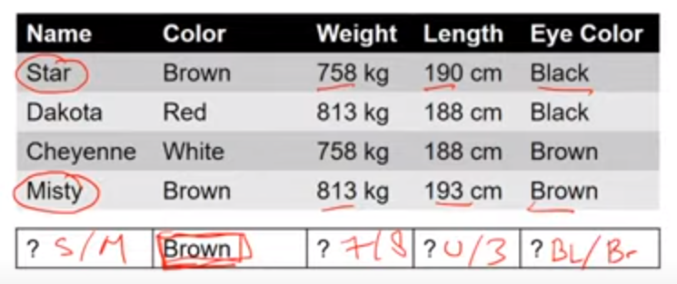
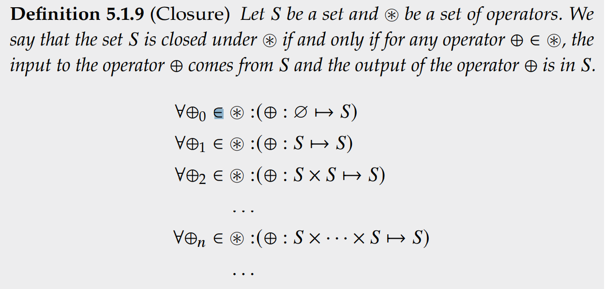
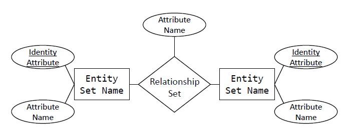
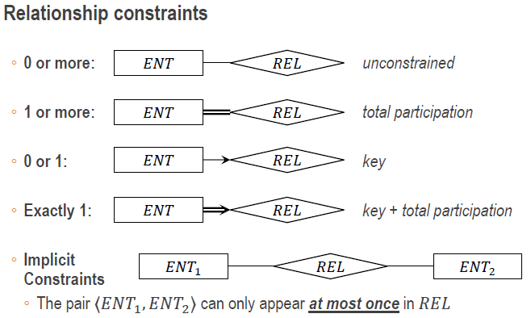
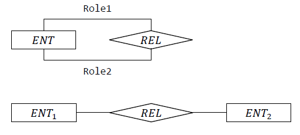
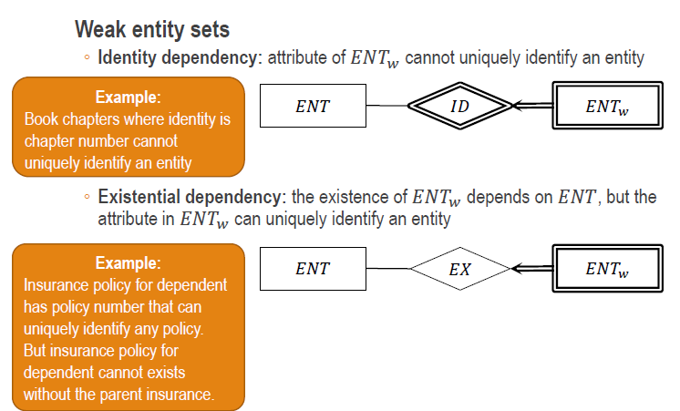
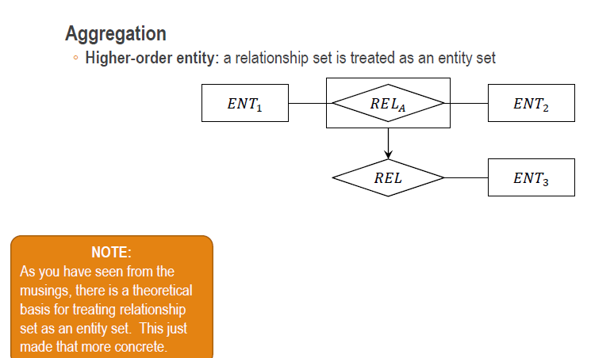
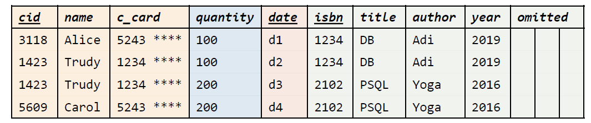

# CS2102 - Database Systems

# Links to video lectures

1. Lecture 1: [https://youtu.be/1DO5Hn_DdH8](https://youtu.be/1DO5Hn_DdH8)
2. Lecture 2: [https://youtu.be/lw6QNHTYM9c](https://youtu.be/lw6QNHTYM9c)
3. Lecture 3: [https://youtu.be/PIgMYbBnpkE](https://youtu.be/PIgMYbBnpkE)
4. Lecture 4: [https://www.youtube.com/watch?v=WobyMqC6UQE](https://www.youtube.com/watch?v=WobyMqC6UQE)
5. Lecture 5: [https://www.youtube.com/watch?v=ap2vbqNFVI0](https://www.youtube.com/watch?v=ap2vbqNFVI0)

Taught using postgresql 12.

# Lecture 1

## Introduction

What is a Database?

A database constraints relations between tables.
All relations can be represented with a table.

What is data?

The properties we are interested in: color, age, height, name, anything that makes us happy.
Data represents a real world object.

if two or more rows of in the table have exactly the same value, they represent the same thing.
Or duplicate tuples in a set are deleted by virtue of set.

## Anatomy of data

A table contains _attributes_, which is the column header.
We can view the attribute as a set, the values in the column are elements of the set.

A _Schema_ is an ordered sequence of attributes.
This is used to describe the structure of the Table.
We need to know this schema if we want to insert data into the table.
Data types are part of the schema.

If we extract a column without the header, this is known as the _Domain_.
The domain should have no duplicates.

One row in a table is the _Data_.
A collection of Data in multiple tables is a Database.

_Degree/Arity_ is the number of attributes in the table.
This is from set theory $S_1 \times S_2$, we are multiplying two sets, so it has degree 2.

_Cardinality_ is the number of rows.
It can be infinite, assuming infinite storage.

Every Table is a **Relation Instance**.
Instance is the collection of data with the header.
The Instance must be valid, where all the data must satisfy constraints such as: negative height.

Each column already has a domain/type constraint.
Each column can only accept the same type.

## Key



> _Superkey_ (definition 2.1.3): is a set of attributes that can uniquely identify rows in the relation instance.  
> All super sets of a superkey are also superkeys.
>
> _Key_ (definition 2.1.3): A minimal set of attributes that can uniquely identify rows in the relation instance
>
> _Candidate key_ (remark 2.1.6): Any key that has potential to be a primary key
>
> _Primary Key_ (remark 2.3.1): One of the candidate keys that actually identifies rows in the relation instance.  
> Primary Keys are **UNIQUE** and **NOT NULL**.

Given a table, if I give you a row with one field filled, can I get the remaining fields.
From the example above, given a color it cannot identify the rest.
We can be given both Color and Eye Color, we can identify the rest.

_SuperKey_ is just the identity. a set of columns, that when given the values of these columns, we can uniquely identify the remaining columns.
There is at least one SuperKey, which contains every column.
$\{col1, col2, ...\}$

We can remove attributes from from the SuperKey. Eventually we get _Key_, where the removal of any more attribute in the key will not make it a SuperKey.
A _Key_ is a minimal SuperKey.
Since it is the local , there can be multiple Keys.
All keys are _Candidate Keys_, they are candidates for us to choose to be our _Primary Key_.
Primary Key is the key that we choose. It must be unique and not $NULL$.

_Foreign Key_ is also called an existential dependency.
A value in a row, depends on the existence on another value, either in a row in the same table or another table.
A Foreign key must either exist, or it is **NULL**, represented with a dash '-'.
As long as one of the value is NULL, it does not break foreign key constraint.
Examples:

- If $\langle A \rangle$ refers to $\langle B \rangle$, then $\langle B \rangle$ must be a candidate key and
  - Either the value $\langle a \rangle$ of $\langle A \rangle$ is NULL
  - Or the value $\langle a \rangle$ exist in $\langle B \rangle$
- If $\langle A, B\rangle$ refers to $\langle C, D \rangle$, then$\langle C, D \rangle$ must be a candidate key and
  - Either one of the values $a$ or $b$ (or both) in $\langle a, b \rangle$ of $\langle A, B \rangle$ is NULL
  - Or the value $\langle a, b \rangle$ of$\langle A, B \rangle$ exists in $\langle C, D \rangle$

NULL can be used for any type.
It has a lot of weird properties.
Primary Key **CANNOT** be null.
It used to be able to, a long time ago.

```
// For booleans
TRUE != FALSE != NULL != TRUE
!NULL == NULL

// For integers
1 + 2 = 3
1 + NULL = NULL

1 < 2 // TRUE
2 > NULL // NULL(boolean null)

NULL == NULL // NULL
NULL != NULL // NULL
```

in sql, we use `IS DISTINCT FROM` to as an operation to take care of NULL.
To check for unique values, while taking into account for NULL values:

- if both not null : `a != b`
- if both null: `False`
- if one is null, the other is not: `True`

```
NULL IS NOT DISTINCT NULL // TRUE
NULL IS DISTINCT FROM NULL // FALSE
```

# Lecture 2

## How to ask from tables.

Key Ideas, highlighted by Edgar F Codd. If we want to query a table we need:

1. Order Independence
   - Order can be randomized
2. Implementation Independence
   - The underlying Implementation of a database should not matter, hash table or graph or anything
3. Columns accessed by attributes
   - Columns can be randomized, maybe due to optimization reasons in implementation
   - each row instead of a tuple, it is then a set. (1, 0) and (0, 1) are the same
   - Contested by others
   - To access can still use attribute names

Key Concept:

- SQL is a declarative language, describe what we want.
  - Describe what we want, not how we want to get data
- All data we need is represented as one massive table
  - Universal Relation
  - To be split up using `Entity Relation Model`

Originated from Relational Calculus, not covered in class. denoted $\{\langle a, b, c\rangle \mid \text{condition}\}$.
Instead we use relational algebra, which is more imperative

## Relational Algebra

Relational algebra is a formal language for queries on relations. Some basic operations:

- Unary Operator
  - Selection $\sigma$
  - Projection $\pi$
  - Renaming $\rho$
- Binary Operator
  - Union $\cup$
  - Intersection $\cap$
  - Difference $-$
  - Cartesian Product $\times$

> **Remark 5.0.1** (Relational Algebra) By relations, we meant Mathematical relations (Section 0.3) instead of database relation schema (Definition 1.1.3).
>
> Mathematical relations $R$ correspond to relation instance $[R]$ in relational model (Definition 1.1.4).

It is important to remember that duplicate tuples are removed by virtue of set. Since we assume that if they contain the same data, they refer to the same real world object.

## Basic Operators

### Unary Operator

#### _**Selection $\sigma$**_

> **Definition 5.1.1** (Selection)
> We define selection operators as a family of functions
> $\sigma_c:\mathcal{R}\mapsto\mathcal{R}$.
> The function takes in a relation $R_1\in\mathcal{R}$ and returns a new relation $R_2\in\mathcal{R}$
> such that all the tuples in $R_2$ are tuples in $R_1$ satisfying the selection condition $c$.
> $$\sigma_c(R)=\{t\mid t \in R \land c[\text{schema}(R)\mid t]\}$$
> or simply: $\sigma_c(R)$ selects tuples $t$ from relation $R$ that satisfies selection condition $c$

Or even more simply, we filter(select) out the data sets we have $R$
Suppose we have $R(A_1, A_2)$ be a schema.
if we want to find all elements in $R$ such that the value of $A_1$ is less than 10 or equal to the value of 10.
$\Longrightarrow\sigma_{A_1 <10\lor A_1 = A_2}(R)$

#### _**Projection $\pi$**_

> **Definition 5.1.2** (Projection)
> We define projection operators as a family of functions $\pi_l:\mathcal{R}\mapsto\mathcal{R}$.
> The function takes in a relation $R_1\in\mathcal{R}$ and returns a new relation $R_2\in\mathcal{R}$
> such that all tuples in $R_2$ consists only of attributes given in list of attributes $l$.
> $$\pi_l(R)=\{t\mid t_0 \in R\land t=t_0.l\}$$
> In other words. $\pi_l(R)$ projects attributes given by a list $L4 of attributes from relation $R\$.

It is a restricted `MAP`, for example, we cannot create new columns.
Or simply, we select the columns, and rearrange to project them to how we want them.
Simply we filter and take only attributes(columns) as defined in $l$.
Let $R(A_1, A_2, A_3)$ be a schema, we can find all elements in $R$ excluding the values of $A_2$ satisfying the schema $R_0(A_3, A_1)$ by stating $\pi_{A_3, A_1}(R)$

#### _**Renaming $\rho$**_

> **Definition 5.1.3** (Renaming)
> We define renaming operators as a family of functions
> $\rho_{R_0(A^1, ..., A^n)}:\mathcal{R}\mapsto\mathcal{R}$ or $\rho_{R_0}:\mathcal{R}\mapsto\mathcal{R}$
> The function takes in $R(A_1, ..., A_n)\in\mathcal{R}$ and returns the relation $R_0(A^1,...,A^n)\in R$ with only changes in relation and attribute names
> $$\rho_{R_0(A^1,...,A^n)}(R(A_1,...,A_n)) renames R(A_1,...,A_n) \text{ into }R_0(A^1,...,A^n)$$

We rename the column names

We can change the relation name only $\rho_{\text{NewRelationName}}$. or change the whole thing
$\rho _{R(A^1_1, ..., A^1_n)}$

If we want to rename one attribute, we also need to rename the rest to be the original.

### Binary Operator

Binary means two, so these operations act on two relations

### _**Union $\cup$**_

> **Definiton 5.1.4** (Union Compatibility)
> Let $R_1$ and $R_2$ be relation schema.
> We say that they are union compatible, denoted by $R_1 \approxeq R_2$
> if and only if both of the following properties are satisfied:
>
> 1. They have the same number of attributes / arity. $R_1(A^1_1, ..., A^1_n) \text{ and } R_2(A^2_1, ..., A^2_n)$
> 2. The corresponding attributes have the same domains.
>    $\mathcal{Dom}(A^1_1) = \mathcal{Dom}(A^2_1),...,\mathcal{Dom}(A^1_n)=\mathcal{Dom}(A^2_n)$
>
> Notes:
>
> - This property is needed for _union, intersection, and difference_
> - We use $\not\approxeq$ to denote non union compatible relations.
> - The attribute names are irrelevant in determining union compatibility
> - Operation on union compatible relation schemas produce relation schema

$R_1 \approxeq R_2$ means that a tuple from $R_1$ can be inserted to $R_2$
and a tuple from $R_2$ can be inserted to $R_1$.

For example:

- $R\approxeq R$
- $R_1(A_1:\text{INT}, A_2:\text{INT}) \approxeq R_2(A_3:\text{INT}, A_4:\text{INT})$
- $R_1(A_1:\text{CHAT}, A_2:\text{INT}) \not\approxeq R_2(A_1:\text{INT}, A_2:\text{INT})$

> **Definition 5.1.5** (Union)
> We define union operator as a funtion $\cup : \mathcal{R}\times\mathcal{R}\mapsto\mathcal{R}$.
> The function takes in two relations $R_1, R_2 \in \mathcal{R}$ and returns a new relation $R_3$
> such that each tuple in $R_3$ is a tuple in either $R_1, R_2$, or both.
> We write the function in _infix_ notation as $R_3 = R_1\cup R_2$.

Let $R_1(A^1_1, A^1_2)$ and $R_2(A^2_1, A^2_2)$ be schemas with the following instances.

- $R_1 \{\langle 1, 10 \rangle, \langle 2, 20 \rangle\}$
- $R_2 \{\langle 2, 20 \rangle, \langle 3, 30 \rangle\}$

$R_1\cup R_2 = R(A^1_1, A^1_2)$ with the following instances $\{\langle 1, 10\rangle, \langle 2, 20 \rangle, \langle 3, 30 \rangle\}$

### _**Intersection $\cap$**_

> **Definition 5.1.6** (Intersection)
> We define intersection operator as a function $\cap : \mathcal{R}\times\mathcal{R}\mapsto\mathcal{R}$.
> The function takes in two relations $R_1, R_2\in \mathcal{R}$ and returns a new relation $R_3$ such that each tuple in $R_3$ is a tuple in both $R_1 \text{ and } R_2$
> We write the function in _infix_ notation as $R_3 = R_1 \cap R_2$.

Let $R_1(A^1_1, A^1_2)$ and $R_2(A^2_1, A^2_2)$ be schemas with the following instances.

- $R_1 \{\langle 1, 10 \rangle, \langle 2, 20 \rangle\}$
- $R_2 \{\langle 2, 20 \rangle, \langle 3, 30 \rangle\}$

$R_1\cap R_2 = R(A^1_1, A^1_2)$ with the following instances $\{\langle 2, 20\rangle\}$

### _**Difference $-$**_

> **Definition 5.1.7** (Difference)
> We define difference operator as a function $-:\mathcal{R}\times\mathcal{R}\mapsto\mathcal{R}$.
> The function takes in two relations $R_1, R_2\in \mathcal{R}$ and returns a new relation $R_3$ such that each tuple in $R_3$ is a tuple in $R_1$ but not in $R_2$. we write the function in _infix_ notation as $R_3=R_1-R_2$

Or simply, int he case $R_1 - R_2$ we select the instances in $R_1$ that are not in $R_2$.

For example: let $R_1(A^1_1, A^1_2)$ and $R_2(A^2_1, A^2_2)$ be schemas with the following instances.

- $R_1 \{\langle 1, 10 \rangle, \langle 2, 20 \rangle\}$
- $R_2 \{\langle 2, 20 \rangle, \langle 3, 30 \rangle\}$

$R_1 - R_2 = R(A^1_1, A^1_2)$ with the following instances \$\{\langle 1, 10\rangle\}

### _**Cartesian Product $\times$**_

> **Definition 5.1.8** (Cartesian)
> We define cartesian operator as a function
> $\times : \mathcal{R}\times\mathcal{R}\mapsto\mathcal{R}$.
> The function takes in two relations $R_1(A^1_1, ..., A^1_n)\in \mathcal{R}$ and
> $R_2(A^2_1, ..., A^2_m)\in \mathcal{R}$
> and return $R_3(A^1_1, ..., A^1_n, A^2_1, ..., A^2_m)$.
> $$R_1\times R_2 = R_3 = \{\langle var^1_1,...,var^1_n,var^2_1,...,var^2_m \rangle \mid \langle var^1_1, ..., var^1_n\rangle\ \in R_1 \land \langle var^1_1, ..., var^2_m\rangle\ \in R_2 \}$$
> We write the function in _infix_ notation as $R_3 = R_1 \times R_2$

Let $R_1(A^1_1, A^1_2)$ and $R_2(A^2_1, A^2_2)$ be schemas with the following instances.

- $R_1 \{\langle 1, 10 \rangle, \langle 2, 20 \rangle\}$
- $R_2 \{\langle 2, 20 \rangle, \langle 3, 30 \rangle\}$

$R_1 \times R_2 = R(A^1_1, A^1_2, A^2_1, A^2_2)$ with the following instances $\{\langle 1, 10, 2, 20 \rangle, \langle1, 10, 3, 30\rangle, \langle2, 20, 2, 20\rangle, \langle2, 20, 3, 30\rangle\}$

Remark 5.1.5 (Cartesian) Note that by definition, we have the following properties on the schema.

1. $R_1(A_1) \times R_2(A_2) = R(A_1, A_2)$
2. $R_2(A_2) \times R_1(A_1) = R(A_2, A_1)$
3. $(R_1(A_1) \times R_2(A_2)) \times R_3(A_3) = R(A_1, A_2, A_3)$
4. $R_1(A_1) \times (R_2(A_2) \times R_3(A_3)) = R(A_1, A_2, A_3)$

We can observe from (1) and (2) that Cartesian operator is non-commutative
From (3) and (4) shows that Cartesian operator is associative.

## Closure



Or simple, operators that follow closure property, when acting on a type $t$ with result in type $t$. For example:

1. $\Z^{+} \text{ is closed under } \{+,\times\} \text{ but not under } \{-, \div\}$
1. $\Z \text{ is closed under } \{+, -, \times\} \text{ but not under } \{\div\}$

**Theorem 5.1.1** (Closure of Relational Algebra)
Let $\mathcal{R}$ be a set of relations. Then the set is closed under operations in relational algebra: $\{\sigma_c, \pi_l, \rho_{R(A-1, ..., A_n)}, \cup, \cap, -, \times\}$

## Join Operators

### Inner Join

> **Definition 5.2.1** (Inner Join)
> We define inner join operator as a function
> $\Join_c :\mathcal{R}\times\mathcal{R}\mapsto\mathcal{R}$
> with the following definiton.
> $$\mathcal{R}_1\Join_c\mathcal{R}_2\overset{\Delta}{=}\sigma_c(\mathcal{R}_1\times\mathcal{R}_2)$$
> So we perform a cartesian product, but then we filter out some of the data.
> In Inner join, we ignore dangling tuples. (Remark 5.2.1) see below

So the idea is that we do cartesian product with some filters, so maybe $\mathcal{R}_1(A_1)=XYZ$

> **Dangling tuples**
>
> - Left Dangling tuples
>   - $\mathcal{R}_1\rhd_c\mathcal{R}_2\overset{\Delta}{=}\mathcal{R}_1-\pi_{\mathcal{R}_1}(\mathcal{R}_1\Join_c\mathcal{R}_2)$
>   - Or simply, the tuples that are not selected / filtered out that are on the left relation $\mathcal{R}_1$
> - Right Dangling tuples
>   - $\mathcal{R}_1\lhd_c\mathcal{R}_2\overset{\Delta}{=}\mathcal{R}_2-\pi_{\mathcal{R}_2}(\mathcal{R}_1\Join_c\mathcal{R}_2)$
>   - Or simply, the tuples that are not selected / filtered out that are on the right relation $\mathcal{R}_2$

For example: let $R_1(A^1_1, A^1_2)$ and $R_2(A^2_1, A^2_2)$ be schemas with the following instances.

- $R_1 \{\langle 1, 10 \rangle, \langle 2, 20 \rangle\}$
- $R_2 \{\langle 2, 30 \rangle, \langle 3, 40 \rangle\}$

$R_1 \Join_{A^1_1=A^2_1} R_2 = R(A^1_1, A^1_2, A^1_1, A^2_2)$ with the following instances
$\{\langle 2, 20, 2, 30\rangle\}$

We can also get the dangling tuples:

- $\mathcal{R}_1\rhd_{A^1_1=A^2_1}\mathcal{R}_2=\{\langle 1, 10\rangle\}$
- $\mathcal{R}_1\lhd_{A^1_1=A^2_1}\mathcal{R}_2=\{\langle 3, 10\rangle\}$

### Outer Join

> Definition 5.2.2\*\* (Outer Join)
> Let $NULL(\mathcal{R})$ be an instance of relation schema $\mathcal{R}$
> such that is has a single row, which is a tuple containing only $NULL$ values.
>
> We define the left outer join as a function
> $=\Join_c :\mathcal{R}\times\mathcal{R}\mapsto\mathcal{R}$
> with the following definition.
> $$\mathcal{R}_1=\Join_c\mathcal{R}_2\overset{\Delta}{=}(\mathcal{R}_1\Join_c\mathcal{R}_2)\cup((\mathcal{R}_1\rhd_c\mathcal{R}_2)\times NULL(\mathcal{R}_2))$$
> We define right outer join operator as a function
> $\Join=_c:\mathcal{R}\times\mathcal{R}\mapsto\mathcal{R}$ > $$\mathcal{R}_1\Join=_c\mathcal{R}_2\overset{\Delta}{=}(\mathcal{R}_1\Join_c\mathcal{R}_2)\cup(NULL(\mathcal{R}_1)\times (\mathcal{R}_1\lhd_c\mathcal{R}_2))$$
> We define full outer join operator as a function
> $=\Join=_c:\mathcal{R}\times\mathcal{R}\mapsto\mathcal{R}$

<!-- TODO get left and right and full outer join symbol properly -->

For example: let $R_1(A^1_1, A^1_2)$ and $R_2(A^2_1, A^2_2)$ be schemas with the following instances.

- $R_1 \{\langle 1, 10 \rangle, \langle 2, 20 \rangle\}$
- $R_2 \{\langle 2, 30 \rangle, \langle 3, 40 \rangle\}$

We can then get the following

- $\mathcal{R}_1=\Join_{A^1_1=A^2_1}\mathcal{R}_2=\{\langle 1, 10, NULL, NULL\rangle, \langle 2, 20, 2, 30\rangle\}$
- $\mathcal{R}_1\Join=_{A^1_1=A^2_1}\mathcal{R}_2=\{\langle 2, 20, 2, 30\rangle, \langle NULL, NULL, 3, 40 \rangle\}$
- $\mathcal{R}_1=\Join=_{A^1_1=A^2_1}\mathcal{R}_2=\{\langle 1, 10, NULL, NULL\rangle, \langle2, 20, 2, 30\rangle\, \langle NULL, NULL, 3, 40 \rangle\}$

### Natural Join

> **Definition 5.2.3** (Natural Join)
> We define natural join as a function
> $\Join : \mathcal{R}\times\mathcal{R}\mapsto\mathcal{R}$
> with the following definition.
> $$\mathcal{R}_1\Join\mathcal{R}_2\overset{\Delta}{=}\pi_{\mathcal{R}\cup\mathcal{R}_2}(\sigma_{\wedge_{A\in(\mathcal{R}_1\cap\mathcal{R}_2)}\mathcal{R}_1.A=\mathcal{R}_2.A}(\mathcal{R}_1\times\mathcal{R}_2))$$
> If there are not common attributes $(\mathcal{R}_1\cap\mathcal{R}_2=\empty)$, the operation reduces to Cartesian operator

For example: let $R_1(A_1, A^1_2)$ and $R_2(A_1, A^2_2)$ be schemas with the following instances.
Notice how both have the same attribute $A_1$.

- $R_1 \{\langle 1, 10 \rangle, \langle 2, 20 \rangle\}$
- $R_2 \{\langle 2, 30 \rangle, \langle 3, 40 \rangle\}$

Then, $\pi_{A_1, A^1_2, A^2_2}(\mathcal{R}_1 \Join_{\mathcal{R}_1.A_1=\mathcal{R}_2.A_1}\mathcal{R}_2) = \mathcal{R}(A_1,A^1_2,A^2_2)$ with the following instance:
$\{\langle 2, 20, 30 \rangle\}$
This is equivalent to
$\mathcal{R}_1\Join\mathcal{R}_2$

# Lecture 3

## syntax

- `CREATE`, Keywords denoted by all caps,
- `_Italic_`, Identifiers or names, usually user specified
- `**Bold**`, BNF(Backus-Naur Form) elements, these are elements or expressions that have been predefined
- `[e]`, the elements inside the square bracket are optional
- `...`, means the previous expression or expressions
- `{e1 | e2}`, Choose either e1 or e2
- `e*`, 0 or more elements `e`

## Creating a table

To create a table with a name _table_name_

> CREATE TABLE [IF NOT EXIST] _table_name_  
> ([{_col_name_ **data_type** [**col_constraint**]\*  
> | **table_constraint**} [,...]]);

### **col_constraint**

- Checks the given column
- Reject on FALSE

| Keywords               | Constraint                                                                |
| ---------------------- | ------------------------------------------------------------------------- |
| PRIMARY KEY            | primary key constraint (the column is a candidate key with one attribute) |
| REFERENCES table(col1) | Foreign key constraints (the column references column col1 of table)      |
| UNIQUE                 | uniqueness constraint (the given column must be unique)                   |
| NOT NULL               | Not null constraint ( the given column must be unique)                    |
| CHECK (expression)     | General constraint (check that the given expression is not false)         |

Where **col_constraint** is as follows

> [CONSTRAINT *constraint_name*]  
> { [NOT] NULL | CHECK (**expression**)  
> | DEFAULT **default_expression**  
> | UNIQUE | PRIMARY Key  
> | REFERENCES _table_name_ > [(_col_name_ [, _col_name_]\*)][on {delete | update} **ref_action**]}

### **table_constraint**

- Checks the given table
- Reject on False

| Keywords                                                        | Constraint                                                                                                                               |
| --------------------------------------------------------------- | ---------------------------------------------------------------------------------------------------------------------------------------- |
| PRIMARY KEY (col1, ..., colN)                                   | primary key constraint (the given column _{col1, ..., colN}_ is a candidate key with $N$ attribute)                                      |
| FOREIGN KEY (colA, ..., colM) REFERENCES table(col1, ..., colN) | Foreign key constraints (the given column references columns $\langle col1, ..., colN\rangle$ of table). The number of column must match |
| UNIQUE (col1, ..., colN)                                        | uniqueness constraint (the given columns must be unique with all values in all given columns be equal)                                   |
| CHECK (expression)                                              | General constraint (check that the given expression is not false)                                                                        |

Where _table_constraint_ is as follows

> [CONSTRAINT *constraint_name*]  
> {CHECK (**expression**)  
> | UNIQUE (_col_name_ [, *col_name*]\*)  
> | PRIMARY KEY (_col_name_ [, *col_name*]\*)  
> | FOREIGN KEY (_col_name_ [, *col_name*]\*)
> REFERENCES _table_name_ > [(_col_name_ [, _col_name_]\*)][on {delete | update} **ref_action**]}

### **ref_action**

Where **ref_action** is as follows
**ref_action** ::== NO ACTION | RESTRICT | CASCADE | SET NULL | SET DEFAULT

Foreign Key Action

- `ON DELETE action`
- `ON UPDATE action`

| useful actions | Description                                                                                         |
| -------------- | --------------------------------------------------------------------------------------------------- |
| CASCADE        | Propagate the action to any referencing tuples ( ex: if deleted then delete any referencing tuples) |
| SET DEFAULT    | Update foreign keys of referencing tuples to the default value (if possible)                        |
| SET NULL       | Update foreign keys of referencing tuples to NULL value (if possible)                               |

### **data_type**

Full documentation found at [https://www.postgresql.org/docs/12/datatype.html](https://www.postgresql.org/docs/12/datatype.html)

| data type                       | Values                                                         |
| ------------------------------- | -------------------------------------------------------------- |
| BOOL                            | boolean                                                        |
| INT, BIGINT                     | integer                                                        |
| NUMERIC, DECIMAL,               | fixed point                                                    |
| NUMERIC(p, s), DECIMAL(p, s)    | maximum total of p digits with maximum of s in fractional part |
| REAL, DOUBLE PRECISION          | floating point                                                 |
| DATE, TIME, DATETIME            | date and time                                                  |
| CHAR, VARCHAR, VARCHAR(n), TEXT | characters and texts                                           |

## Modifying a table

### Altering a table

Using SQL

```sql
ALTER TABLE table_name action
```

| Actions                          | Description                                                          |
| -------------------------------- | -------------------------------------------------------------------- |
| ADD COLUMN column_name data_type | Add the specified column with the given data type into the table     |
| DROP COLUMN column_name          | Remove the specified column                                          |
| Add _table_constraint_           | Add the specified table constraint                                   |
| DROP CONSTRAINT constraint_name  | Remove the specified constraint that was created with the given name |

### Inserting a row to a table

Using SQL

```sql
INSERT INTO table_name VALUES (val1, ..., valN);

INSERT INTO table_name (col1, ..., colN) VALUES (val1, ..., valN)
```

### Removing rows from a table

Using SQL

```sql
DELETE FROM table_name WHERE condition;
```

### Updating rows on a table

Using SQL

```sql
UPDATE table_name SET column_name = expression WHERE condition
```

### Select queries

Using SQL

```sql
SELECT [DISTINCT] a1 As c1, a2 AS c2, ... FROM t1, t2, t3 WHERE condition
```

# Lecture 4 - ER Diagram

Entity Relation Diagram

Basic:

- Attributes: Information describing real-world objects (height, weight) represented as a circle
- Entities: Representation of real-world objects (horse, person, has attributes) represented as a rectangle
  - An entity set is a collection of entities (table)
- Relationships: association between two or more entities (owner relationship) represented as a diamond
  - Also tables, but have references to other tables.



- Identity attribute: an attribute that uniquely identifies an entity, represented with underline (primary key).
  - ER Diagram does not show candidate keys, only shows primary keys
- Relationship cannot have its own separate identities.
  - Although it is possible to do it, is should not do it.
- Diagrams are just useful way to represent the model, the meaning still dependent on you.

## ER Model



- _Unconstrained_
- _Total participation_
  - Every entity in the entity set must have at least an entry in the relationship set
- _Key_
  - Every entity in the entity set can have at most one entry in the relationship set
- _Key + total participation_
  - Exactly one

## Arity of a relationship set

number of relationship in a relationship set.

:want

## Weak Entity Sets

- Identity dependency
  - Cannot uniquely identify any entity within the weak entity set
  - a book has chapters, but the chapter cannot uniquely identify the book. Many books can have the same chapter
- Existential dependency
  - Can uniquely identify any entity within the weak entity set
  - A policy can have child policies, these child policies are usually unique, thus can uniquely identify



## ISA (IS A) hierarchies

ISA hierarchies

- Subclass-superclass relationship (specialized vs generalized)
- All specialized entity sets inherits attributes from generalized sets
- Each entity sets may be associated with different relationship set

The constraints that exist for ISA hierarchies:

- Overlap
  - satisfied if can belong to multiple specialized subclasses
- Covering
  - satisfied if every generalized entity has to be in some specialized entity sets.

## Aggregation

We cannot use relations as reference to other relations.
We need to aggregate it to become a entity.



# Lecture 5

## Pattern Matching

```sql
SELECT ___
FROM ___
WHERE attr LIKE pattern
```

Rule for patterns:

- Underscore(\_): match any 1 character
- Percent(%): match 0 or more of any characters
- Characters(abc..): match exactly 1 of the given character

## Case Analysis

We can also do Case (example 6.1.5) when selecting to give different result for different case, similar to if-else

Consider the relation schema $R(A_1, A_2)$.
Find the value of $A_1$ and the value GRADE computed as follows:

1. If $A_2$ is greater than or equal to 85, result is ’A’.
2. Else if $A_2$ is greater than or equal to 75, result is ’B’.
3. Else if $A_2$ is greater than or equal to 75, result is ’C’.
4. Else if $A_2$ is greater than or equal to 55, result is ’D’.
5. Otherwise, the result is ’F’.

> SELECT A_1, CASE
> WHEN A_2 >= 85 then 'A'  
> WHEN A_2 >= 75 then 'B'  
> WHEN A_2 >= 65 then 'C'  
> WHEN A_2 >= 55 then 'D'  
> ELSE 'F'  
> END AS GRADE  
> FROM R;

## NULLIF

```sql
SELECT NULLIF(attr, value)
```

if the _attr_ has the given value, then it should return NULL, else return value

## Coalesce

In sql:

```sql
COALESCE(attr1[, ..]*) AS ATTEMPTS
```

This will find the first non-null value from the list of attributes in the given order and rename as ATTEMPTS.

## UNION/INTERSECT/EXCEPT

- EXCEPT = difference
- UNION = union / get all
- INTERSECT = intersect / find the same

```sql
SELECT __ FROM __ WHERE __
{ UNION | INTERSECT | EXCEPT } [ALL]
SELECT __ FROM __ WHERE __
```

All means we keep duplicates in the final result

## JOIN

| name             | syntax                                                                           | meaning                                                                                                                                                                                                                                                                                   |
| ---------------- | -------------------------------------------------------------------------------- | ----------------------------------------------------------------------------------------------------------------------------------------------------------------------------------------------------------------------------------------------------------------------------------------- |
| Inner Join       | `SELECT ___`<br> `FROM table1 INNER JOIN table2 ON condition` <br> `WHERE ___`   | $table1 \bowtie_\text{condition} table2$ <br> Join the two tables on rows that satisfy given conditions <br> $\sigma_\text{condition}\left(\text{table1} \times \text{table2}\right)$                                                                                                     |
| Left Outer Join  | `SELECT ___`<br> `FROM table1 LEFT JOIN table2 ON condition` <br> `WHERE ___`    | $table1 =\bowtie_\text{condition} table2$ <br> Join the two tables on rows that satisfy given conditions<br> Entries from table2 may be replaced with $NULL$ values <br> Entries from table1 will not have NULL values                                                                    |
| Right Outer Join | `SELECT ___`<br> `FROM table1 RIGHT JOIN table2 ON condition` <br> `WHERE ___`   | $table1 \bowtie=_\text{condition} table2$ <br> Join the two tables on rows that satisfy given conditions<br> Entries from table1 may be replaced with $NULL$ values <br> Entries from table2 will not have NULL values <br> Can be mimicked by `LEFT JOIN` via projection                 |
| FULL Outer Join  | `SELECT ___`<br> `FROM table1 FULL JOIN table2 ON condition` <br> `WHERE ___`    | $table1 =\bowtie=_\text{condition} table2$ <br> Join the two tables on rows that satisfy given conditions<br> Entries from table1 may be replaced with $NULL$ values <br> Entries from table2 may be replaced with $NULL$ values <br> Can be done by union of INNER, LEFT and RIGHT joins |
| Natural Join     | `SELECT ___`<br> `FROM table1 NATURAL JOIN table2 ON condition` <br> `WHERE ___` | $table1 \bowtie table2$ <br> Join on common attributes <br > If there are no common attributes, natural join is equal to cartesian product <br> is similar to inner joining, on the condition that all common attributes must have equal values, the removing duplicate attributes        |

Notes:

- There is also:
  - Natural Left Join
  - Natural Right Join
  - Natural Full Join

## View

This is a logical view for viewing data.
A virtual table used only for querying.
useful for ISA hierarchy with covering constraint.
Cannot be used for updating (unless updatable view).
It is usually computed on each call, or caching.

```sql
CREATE VIEW view_name (attr1, ...) AS query
```

# Distinct

Distinct vs Unique

# Universal Relation

All your small table, make it to one big table.

# Lecture 6 - Arrgregate

## Aggregattion

| Query                             | Meaning                                         |
| --------------------------------- | ----------------------------------------------- |
| `SELECT MIN(A) FROM R`            | Minimum values from attribute `A`               |
| `SELECT MAX(A) FROM R`            | Maximum values from attribute `A`               |
| `SELECT SUM(A) FROM R`            | Sum of all values in attribute `A`              |
| `SELECT COUNT(A) FROM R`          | Count non-NULL values in attribute `A`          |
| `SELECT AVG(A) FROM R`            | Average values from attribute `A` (sum / count) |
| `SELECT COUNT(*) FROM R`          | Count number of rows in `R`                     |
| `SELECT AVG(DISTINCT A) FROM R`   | Average of distinct values in attribute `A`     |
| `SELECT SUM(DISTINCT A) FROM R`   | Sum of distinct values in attribute `A`         |
| `SELECT COUNT(DISTINCT A) FROM R` | Count of distinct values in attribute `A`       |

What if the attribute is empty or all NULL values?

| Query                    | Empty  | ALL NULL |
| ------------------------ | ------ | -------- |
| `SELECT MIN(A) FROM R`   | `NULL` | `NULL`   |
| `SELECT MAX(A) FROM R`   | `NULL` | `NULL`   |
| `SELECT SUM(A) FROM R`   | `NULL` | `NULL`   |
| `SELECT COUNT(A) FROM R` | `NULL` | `NULL`   |
| `SELECT AVG(A) FROM R`   | 0      | 0        |
| `SELECT COUNT(*) FROM R` | 0      | n        |

## Group By

Sometimes we want to aggregate values on a subset of values

```sql
SELECT ___ \\
FROM ___ \\
WHERE condition \\
GROUP BY col1, col2, ...
```

1. we choose rows that satisfy condition.
2. We divide the rows into groups
   - Such that the values of $\langle col1, col2, ...\rangle$ are the same

Restriction: (one of the following)

- For each column `A` in relation `R` that appears in `SELECT`, one of the following condition must hold:
  - Columns `A` appears in the `GROUP BY` clause
  - Column `A` appears in aggregated expression in SELECT (eg. MIN(A))
- The candidate key of `R` appears in the GROUP BY clause

## Sorting

```sql
SELECT ___
FROM ___
WHERE ___
ORDER BY col1 [ASC | DECS], ...  -- stable sort table based on col1 ascending or descending
OFFSET m -- from m-th rank
LIMIT n  -- show n result
```

## Order of Operation

```sql
SELECT _(5)_
FROM _(1)_
WHERE _(2)_
GROUP BY _(3)_
HAving _(4)_
ORDER BY _(6)_
LIMIT _(7)_
OFFSET _(7)_
```

## Subqueries

We can have queries in queries.

Static Scoping, Table alias (i.e., result of query)`Q`

- Can be used only in `Q` and any subquery nested within `Q`
- Can shadow other`Q` from outer query
- Declare (e.g., renaming) before use

We can also declare Common Table Expression(CTE)

```sql
WITH
tbl1 AS (Q_1), -- compute Q_1
tbl2 AS (Q_2), -- compute Q_2 next, can use tbl1
-- query can use tbl1 and tbl2 as if the are tables.
```

## WHERE Clause

instead opf operators, we also have special function for where clause.
| name | syntax | remarks |
| --- | --- | --- |
| exists | `WHERE EXISTS(Q)` | Returns `true` if the result of `Q` is non-empty <br> do not care what the result is, just needs to be non-empty |
| IN | `WHERE value in (Q)` | Returns `true` if the value ($v$) is in the result of `Q` is non-empty <br> Returns true is one of the following is true $\left(v=v_1, v=v_2, ..., v=v_n\right)$|
| ANY | WHERE value $\approx$ ANY (Q) | $\approx$ is any relational operation <br> Returns `true` if the value ($v$) satisfies the relational operation with any the result of `Q` <br> Returns true if ONE of the following is true $\left(v\approx v_1, v\approx v_2, ..., v\approx v_n\right)$|
| ALL | WHERE value $\approx$ ALL (Q) | $\approx$ is any relational operation <br> Returns `true` if the value ($v$) satisfies ALL relational operation with any the result of `Q` <br> Returns true is ALL of the following is true $\left(v\approx v_1, v\approx v_2, ..., v\approx v_n\right)$|

# SQL Summary

# Miscellaneous

## How are constraints checked?

The problem is there is not only `true` or `false`, there is also `null`. So instead we reject `false`.
This is because `null == null` will return in `null`

$(a \overset{\Delta}{=} b)$, this means $a$ is defined to be $b$

# Functional Dependencies


If we have one major unified table, instead of splitting the tables up, we can have the following problems:

- Insertion anomaly : we cannot store any customer if they have never made a purchase
- Deletion anomaly : if we delete all books with isbn 1234, we lose information about Alice
- Update anomaly : if Trudy credit card number change, we have to be careful of consistent updates ( update on all places )

We can easily split up the tables. One for user, one for book and so on.
This solves the issues above.

## Syntax / Notation

- Relation
  - Schema: `R(A1, A2, ...)`, describes a table, the headers
  - Instance: `r`, an instance of a relation
- Attributes
  - Single `A, A1, A2`
  - Set `a, a1, a2`
- Shorthand Notation
- $ab \Leftrightarrow a \cup b$
- $AB \Leftrightarrow \{A, B\}$
- $Ab \Leftrightarrow \{A\} \cup b$
- $b-A \Leftrightarrow b - \{A\}$

Definition

- `a -> b`
  - a Uniquely identifies b, for all valid relation instance
  - $\pi_a(t_1) = \pi_a(t_2) \Rightarrow \pi_b(t_1) = \pi_b(t_2)$
    - if a projection on $a$ on two tuples give the same result, the result of projection on $b$ , both tupples must also return the same result

Triviality of a -> b

- Trivial : $a \subseteq b$
- Non-Trivial : $a \nsubseteq b$
- Completely non-trivial : $(a \nsubseteq b) \land (a \cap b) = \empty$

Assume $a \neq \emptyset$ and $b \neq \emptyset$

## Armstrongs's Axioms

Properties:

- sound -> any derived fd is implied by $F$
- Complete -> all fd in $F+$ can be derived

Armstrongs's axioms:

- Reflexivity
  - $A \rightarrow A$
  - $a \rightarrow b$ for any $b \subseteq a$
- Augmentation
  - $a \rightarrow b \Rightarrow ac \rightarrow bc$
- Transitivity
  - $a \rightarrow b \land b \rightarrow c \Rightarrow a \rightarrow c$

Extended Armstrong's axioms:

- Armstrong's axioms
- Union
  - $a \rightarrow b \land a \rightarrow c \Rightarrow a \rightarrow bc$
- Decomposition
  - $a \rightarrow b \land c\subseteq b \Rightarrow a\rightarrow c$

Asking questions, given functional dependencies $(F)$ does a new functional dependency $(f)$ hold?
$(\text{Logical implication: } F \models f)$

What is the superkey? key? prime attribute?

- prime attribute is union of all candidate keys
- key -> R

We can also ask for Functional Dependency Closure. $F+ = \{f \mid F \models f\}$, with such we can also say $F \models F+$

We can also ask if two sets of functional dependencies are equal

- $F \equiv G$
  - $F \models G \land G \models F$
  - $F+ \equiv G+$
- can i find a minimal cover?
  - less functional dependencies but case FD closure

Attribute Closure

- Attribute closure of $a (\text{denoted } a+)$
  - All other attributes uniquely identified by the attribute $a$
  - $a+ = \{A\in R \mid F \models a \rightarrow A\}$
- Usage:
  - can find Logical implication: $F \models f$
  - key -> R
    - How to find key? get all with nothing pointing to it
  - can find FD closure: $F+ = \{f \mid F \models f\}$
    - with such we can also say $F \models F+$
  - Can check $F \equiv G$
  - Can find Minimal cover
    - remove redundant attributes (Attribute redundancy)
      - $(F-\{a \rightarrow b\} \cup \{(a - A) \rightarrow b\} \equiv F$
      - If we can remove $A$ from $a$, and the functional dependency remains the same, then $A$ is the same.

# Decomposition

Schema Decomposition allows us to enforce each of the functional dependencies

Definition:

- Set of schema $\{R1, R2, ..., Rn\}$ where each $Ri$ is called fragments such that
  - $Ri \subseteq R$
  - $R = R1 \cup R2 \cup ... \cup Rn$
- Each instance of $Ri$ (called $ri$) can be obtained form the instance $r$ of $R$ via projection
  - $ri = \pi_{Ri}(r)$

Useful properties:

- Lossless-join
  - Preserve information
  - $r = \pi_{R1}(r) \bowtie ...  \bowtie \pi_{Rn}(r)$
  - Guarantees join can obtain original universal relation
    - Decompose $R$ into $n$ fragments, if we use a natural join on each fragment, we should get original relation
  - does not care about $F$
- Dependency preserving
  - Preserve functional dependencies
  - Functional Dependencies projection on a set of attributes $a$
    - $F[a] = \{b \rightarrow c \in F+ \mid bc \subseteq a\}$
  - $F[R1] \cup F[R2] \cup ... \cup F[Rn] \equiv F$
  - Guarantees update on fragments preserves original FDs

Lossless-join vs lossy-join:
Lossy-join does not mean we lose data (no of rows) instead we would most likely gain rows

> Lemma 1  
> $r \subseteq \pi_{R1}(r) \bowtie \pi_{R2}(r) \bowtie ... \bowtie \pi_{Rn}(r)$  
> Number of tuples may increase

If we do not have a lossless join, number of tuples may increase (more rows) because if no common attribute, natural join becomes cartesian product.

> Theorem 1  
> If either one is satisfied  
> $F \models (R1 \cap R2) \rightarrow R1$  
> $F \models (R1 \cap R2) \rightarrow R2$  
> Then decomposition of $R$ into $\{R1, R2\}$ is a lossless join decomposition

$F$ would logically imply one of them.

> Corollary 1
>
> - Let $ a \rightarrow b$ be a completely non-trivial FD that holds for $R$
> - Decomposition of $R$ into $\{R-b, ab\}$ is a lossless-join decomposition

> Theorem 2  
> if $\{R1, R2, ..., Rn\}$ is a lossless-join decomposition of $R$  
> If $\{R1_1, R1_2\}$ is a lossless-join decomposition of $R_1$  
> Then decomposition of $R$ into $\{R1_1, R1_2, R2, ..., Rn\}$ is a lossless-join decomposition

Functional Dependency Projection

- $F[a] = \{b \rightarrow c \in F+ \mid bc \subseteq a\}$
- Dependency preserving
  - $F[R1] \cup F[R2] \cup ... \cup F[Rn] \equiv F$
  - $(F[R1] \cup F[R2] \cup ... \cup F[Rn])+ \equiv F+$
  - $(F[R1] \cup F[R2] \cup ... \cup F[Rn] \models F) \land (F \models F[R1] \cup F[R2] \cup ... \cup F[Rn])$

# Normal forms

From restrictions, we can get Functional dependencies, then through decomposition (Lossless join and dependency preserving) we lead to normal form.
From there we can link back to our ER Diagram.

## FD Enforcement

If we use a universal table (one table containing all information).
It is not possible to ensure all original restrictions are kept, without triggers.

- Transitivity dependencies
  - Hard to enforce the the transitive dependency
  - One way is to split up the table, into different tables, which is lossless and Dependency Preserving

## Normal Forms

A Non-key field must provide a fact about the key(candidate key), the whole key, and nothing but the key.

### Boyce-Codd Normal Form (BCNF)

- No attribute is transitively dependent on any key
  - Every attribute is directly dependent on all key
  - This corresponds to the entity/relationship set

How to check if a relation is in BCNF, without checking all FDs.

- $R$ is in BCNF if every FD $a \rightarrow A$ in F+ is either
  1. $a \rightarrow A$ is trivial
  2. $a$ is a superkey
- $Ri$ is in BCNF if every FD $a \rightarrow A$ in $F[Ri]$ is either
  1. $a \rightarrow A$ is trivial
  2. $a$ is a superkey

> Lemma 2  
> Any schema with exactly 2 attributes is in BCNF

> Theorem 3  
> For any schema $R$ with $F$, there is lossless-join valid decomposition such that each fragments are in BCNF.

> Theorem 4  
> There is a schema $R$ such that
>
> 1. is it not in BCNF
> 2. it has no lossless-join, dependency-preserving valid decomposition such that each fragment is in BCNF

Example: $R(A, B, C)$ with $F = \{AB \rightarrow C, C \rightarrow A\}$

BCNF is too strong, because we decompose until it is not dependency preserving.
Does not remove all redundant FDs.

### Third Normal Form (3NF)

Idea is to use Unique restrictions.

- No non-prime attribute is transitively dependent on any key
  - Every non prime attribute is directly dependent on all key
  - Allows for overlapping keys

How to check?

- $R$ is in 3NF if every FD $a \rightarrow A$ in F+ is either
  1. $a \rightarrow A$ is trivial
  2. $a$ is a superkey
  3. $A$ is a prime attribute
- $Ri$ is in 3NF if every FD $a \rightarrow A$ in $F[Ri]$ is either
  1. $a \rightarrow A$ is trivial
  2. $a$ is a superkey
  3. $A$ is a prime attribute

> Lemma 3  
> Every schema that is in BCNF is in 3NF

> Theorem 5  
> For any schema $R$ with $F$, there is lossless-join dependency-preserving valid decomposition such that each fragments are in 3NF

## Producing normal forms

Decomposition(BCNF) vs Synthesis(3NF)

### Decomposition

Idea:

- Find FD $a \rightarrow b$ that violates the NF property.
  - Corollary 1: $a \rightarrow b \Rightarrow \{R-b, ab\}$
    - Guaranteed lossless join
  - Theorem 2: $\{R1, R2, R3\} \Rightarrow \{R1_1, R1_2, R2, R3\}$
    - Guaranteed lossless join

Properties:

- Termination (Lemma 2)
- Lossless-join (Corollary 1 + Theorem 2)
- Dependency-preserving? no (Theorem 4)

### Synthesis

3NF Synthesis (Bernstein's Algorithm)

Idea:

- Calculate Minimal Cover (no redundant FD and no redundant attribute)
- specifically extended minimal cover (minimal cover then perform union rule from extended Armstrong's Axioms)
  - For each FD in the minimal cover $a \rightarrow b: R(ab)$
  - $R(\text{key})$
    - Pick one key
- remove redundant schema (schema is found in another schema)

Properties:

- Termination (finite elements in minimal cover)
- Dependency-preserving (minimal cover definition)
- Lossless-join (yes, hard proof)
