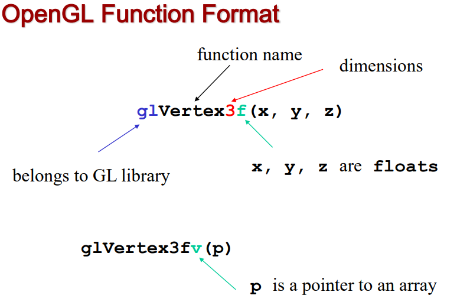
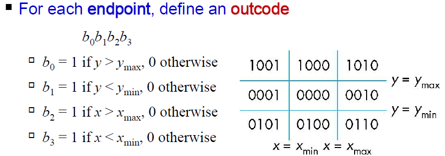
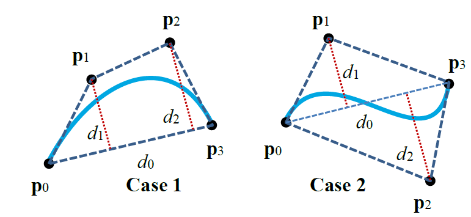

# CS3241 - Computer Graphics

# Lecture 1

## Image Formation

What do we need to create a graphics system.
We get input from users, like texture, 3d models, interactions, user key press to produce appropriate images.

We create an image, generally two dimensional using a system similar to those created by a camera, or microscopes.

Elements of image Formation:

- Objects
  - model of object, the geometry, number of polygons to be feed to graphic system
  - Vertices / Polygons / curves or surface
- Viewer / camera
  - Is it a camera, or an eye.
  - Where the camera is, direction, field of view, color sensitivity
- Lighting / Light Source(s)
  - Brightness
  - The color of light source
  - The shade of the light source
  - Location of light source
  - amount of light sources
- Materials
  - Attributes that govern how light interacts with the materials in the scene
  - The texture
  - How the surfaces of objects reflect light, shiny / smooth / rough
  - Color
  - Albedo $(0\leq Albedo \leq 1)$
    - Amount of light a material reflects
  - Shininess
    - hard to model on computer
    - Smooth surface more shiny compared to rough surface
  - Transparency

These elements are independent from one another. The object, the viewer and the light source should be able to be specified independently.

## Light

We use algorithms to generate the image.
There is usually a need to do light simulation.
Light is the part of the electromagnetic wave spectrum that we can see (visible light, wavelength 350-750 nm).
Long wavelengths appear as reds and short wavelengths as blues.

**How is color represented in images**

Luminance Image

- Monochromatic
- Values are gray levels
- Analogous to working with black and white film or television

Color Image

- contains all colors
- has perception attributes such as hue, saturation and lightness
  - Hue:
  - Saturation:
  - Lightness: How bright / intensity of light
- We do not need to match every frequency in the visible light spectrum:
  - At the back of our eye ball, there is a section for light sensitive cells: rods (monochromatic, useful for dark times) and cones (color sensitive, there are three cones. one is more sensitive to blue, one for green one for red. Based on frequency of wave)
  - only three values are sent to the brain
  - These three cones give sensation of different colors.
  - only need to match these three values, the three primary colors (Red, Green Blue (_RGB_))

When we want to display our coloured images, different media can display images differently

- Additive color
  - User Red, Green, Blue as primary colors
  - adding the values of the primary colors to get the final color.
  - LCD screen emits light
  - white is the "additive" combination of all primary colored lights, while black is the absence of light.
- Subtractive color
  - CMYK (Cyan, Magenta, Yellow, Key(black))
  - Uses Cyan, Magenta, Yellow as primary colors
  - if we mix the primary colors, all light is absorbed, so black is remained
  - Use for printing
  - Because inks "subtract" the colors red, green and blue from white light.
  - white is the natural color of the paper or other background, while black results from a full combination of colored inks.

## Pinhole camera

It is a box that is totally enclosed with a hole on one side, the wall at the other end is where the image on the other side is reflected.
The projection of the image to the screen can be represented using some trigonometry.
The image formed by projection will be inverted.

Advantages of having graphics system that allows input to be input separately:

- They are independent, can input without affecting each other
- two dimensional graphics is a special case of three dimensional graphics
- Leads to simple software API:
  - Specify object, lights, camera, attributes
  - Let implementation determine image
  - Leads to fast hardware implementation

## Global vs Local lighting

Some of the algorithms used to generate image uses either global or local light effect.
Global lighting is more expensive.
An example is a shadow, if there is a shadow, the shadow is cast to another object.
another example: reflection of one object on another.
Local lighting only needs to consider a small part of the input or scene.
The image from local lighting only considers light near the object.
local lighting does not care about the above global lighting effects

# Lecture 2

There are two main parts in graphic rendering system. There is the _renderer_
and an API to pass in input for the renderer

The renderer: takes in input uses some algorithm to create the output

## Models and Architectures

So With the API, we can give in the above inputs ang get an image output.
How are there APIs implemented?

### Physical Approach

This is done in the renderer

#### **Ray Tracing**

To produce an image, we trace rays in the environment.
We shoot out imaginary rays out from eye/camera to each pixel in imaginary world
and potentially intersect objects in the 3d world,
and the color will be the color that the ray passed.
They ray would either be absorbed by objects, go keep bouncing around.
Ray trying can handle global effects:

- Multiple reflections
- can handle translucent objects

But it is very slow, and all the objects in the 3d world/database needs to be available at all times, since we do not know when will a ray potentially collide.

#### **Radiosity: Energy based approach**

- Very slow
- Not general

Simulates the spread of energy in the environment, each area is treated as patches,
then simulates how light energy travels

Generally Ray Tracing and Radiosity is not used in real time, since it is very slow.
New generation of graphics hardware can do real time ray tracing(RTX). Instead we use practical approach

### Practical Approach for Real-Time Rendering

We use a pipeline architecture approach. We do not render the entire scene at one go.
We do not need the whole 3d database in memory.
We draw objects by objects, slowly all to final frame.

- Can consider only local lighting
- Object-oriented rendering(not oop, we render object by object, object-based rendering)

The most common way to describe the surface of a 3d object using polygons.
polygons we described by their vertices.


Each box is a pipeline stage.

1. Vertex Processor
   - Main job: transform the coordinates of the vertex from one coordinate system to another
   - Sometimes there are different coordinate frames/system:
     - Object coordinates
     - Camera (eye) coordinates
     - Screen coordinates
   - Every change of coordinates is equivalent to a matrix transformation
   - Vertex processor also computes vertex colors (lighting)
   - Also responsible for computing projection of 3d objects to 2d image plane
     - calculate geometry of projection
     - If we have a polygon in 3d space, we project that to image plane. vertex processor calculates the coordinate of vertices on 2d image plane.
     - Not all projection calculation is done in vertex processor, most is.
     - Different kinds of projection, the 2 common:
       - Perspective projection
         - The one we are familiar with, how we see the world. Things that are near seem bigger than the one is far
         - All projections converge to a single point of projection
       - Parallel projection
         - all rays move in parallel
         - Does not converge to a single point of projection
2. Clipper and primitive assembler
   - Primitive assembly
     - Primitive is element / primitive shape used to describe geometry of 3d world, example:
       - Polygons
       - Line segments
       - Curves and surfaces
     - In vertex processor the vertices are processed independently
     - In here, we look at the entire polygon
     - So that we can do other operations, such as clipping
       - Which is important since not everything is in view of the eye / camera
       - So we need data like the size, the distance of the polygons
     - Once primitive assembler is complete, we do clipping
       - The camera has limited field of view, at some angle of view
       - But it can be very wide
       - Things that are outside field of view needs to be get rid of
       - But some are partially in view, need to be modified
       - So if a shape is being blocked by another block, needs to produce a new polygon from original after clipping.
3. Rasterizer
   - We do Rasterization (scan conversion)
   - First we select the pixels that would be activated.
   - We now have our polygons projected onto the screen.
   - Only the vertices are projected onto the screen, need to color the polygons
   - Fill in the interior of polygon by turning on the pixels(picture elements) with appropriate color inside the polygon (rasterization)
   - The pixels that are turned on are called fragment
   - Fragments are not pixels because they are "potential pixel"
     - They may not stay in the frame buffer / final image, may disappear.
     - Maybe be overwritten or overlap by fragments coming from another polygon.
     - This fragment may also be removed because it is being blocked/occluded by another polygon, removed in next step
     - each fragment has a location in frame buffer
     - Has color and depth attributes
4. Fragment Processor
   - Determine the color of the corresponding pixel in the frame buffer
   - Process each fragment even further
   - Do like texture mapping
     - We can read from texture image, then copy color to fragment
   - This step also handlers hidden surface removal
   - If a fragment is blocked by another, we need to remove that fragment

After Fragment Processor we go to post processing, then to the frame buffer.
The frame buffer stores the frames to be displayed.
A display reads from the frame buffer to display image.
The display also communicates with Frame buffer, it doesn't just read.
This is to achieve Frame synchronization(G-Sync, adaptive synch technology).
This is because the frame rate (frames generated by GPU) may not be the same as refresh rate(how fast a monitor changes frames).
So if a frame is not ready, will show the same frame.

### API

The pipeline should also provide a way for programmer to interact with it.
The program Uses the API to communicate with Hardware.

What should this API support?
It needs to be able to specify what we need to form an image

- Objects
- Viewer
- Light source
- Material
  API should also:
- capture input from other devices like mouse and keyboard
- identify capabilities of system

The API should support a limited set of primitives including:

- Points (0D object)
- Line segment (1D objects)
- Polygon (2D objects)
- Some curves and surfaces
  - Quadrics
  - Parametric polynomials

They are defined through locations in space or vertices.

The API should also be able to specify camera settings

- six degree of freedom
  - Position of center of lens
  - Orientation
- Lens
- Film size
- Orientation of film plane

The API should also be able to specify Light and Materials

- Types of light
  - Point sources vs distributed sources
  - spot lights
  - Near and far sources
  - Color properties
- Material properties
  - Absorption: color properties
  - Scattering
    - Diffuse
    - Specular

## OpenGL Programming

We use OpenGL 2.1 which is event driven. From OpenGL $\geq$ 3.0 we ca program the rendering pipeline.

### SGI and IRIS GL

Silicon Graphics Inc. (SGI) was the first company that build the entire rendering pipeline on hardware
Other companies still had some steps done on CPU.

- They revolutionized the graphics workstation by implementing the raster graphics rendering pipeline in hardware (1982)
- They also provided the API called IRIS GL (GL = Graphics Library)
- The main goal was for real time interactive rendering

From IRIS GL, We created OpenGL (1992), a platform-independent API that was:

- Similar to IRIS GL, easy to use
- Close enough to the hardware to get excellent performance
  - Nowadays we use more low level apis to control hardware
- Focus on rendering
  - Do not do like database manipulation
  - But OpenGL nowadays used for AI programming, which is not rendering
- Omitted windowing and input to avoid window system dependencies
  - Was available in IRIS GL
  - Done to make it platform independent

OpenGL Evolution:

- Originally Controlled by an Architectural Review Board (ARB)
  - SGI, Microsoft, Nvidia, HP, 3DLabs(no more), IDM, etc...
- Relatively stable (present version 4.x)
  - Evolution reflects new common hardware capabilities
    - 3D texture mapping and texture objects
    - vertex programs
- OpenGL ARB is not part of The Khronos Group (controls many open standards)

We also use GLUT (OpenGL Utility Tooklit), which is not part of OpenGL. It provides functionality common to all window system:

- Open a window
- Get input from mouse and keyboard
- Menus
- Event-driven

OpenGL is responsible for the grey box, the pipeline. Generate image then place to frame buffer.


OpenGL has functions for:

- Primitives (define to be drawn)
  - Points
  - Line Segments
  - Polygons
- Attributes (specify attributes)
- Transformation
  - Viewing
  - Modelling
- Control (GLUT)
- Input (GLUT)
- Query the state (color, what is the transformation)

<!-- Watch webcast find out what this means -->

OpenGL is a state machine, configure by changing the states.
if the current state has color set to red, then all things we draw will be red, until we change state

- Color (points, lines, polygons)
- Size and width (points, lines)
- Stipple pattern (lines, polygons)
- Polygon mode
  - filled or not
  - display edges or not
  - display vertices or not
- If we tell it to draw a `GL_TRIANGLES`, it will take every 3 vertices and make a triangle, and different settings for different shapes.

There are two types of functions:

- Primitive generating
  - Can cause output if primitive is visible
  - How vertices are processed and appearances of primitive are controlled by the state
- State changing
  - Transformation functions
  - Attribute functions

Basic syntax for openGL


- u: Unsigned
- b: byte
- s: short
- f: float
- i: integer
- v: vertex

But underlying storage mode is the same

RGB, each color is stored on separate channel.

We can set viewports, which is a mini view in the window. Then we draw there.

Smooth coloring

- Interpolate vertex colors across visible polygon.
- alternatively use flat shading
- use `glShadeModel(GL_SMOOTH)` or `glShadeModel(GL_FLAT)`

## The following Program generates a white square

```c
#include <GL/glut.h>
void mydisplay() {
  glClear(GL_COLOR_BUFFER_BIT); // clear the frame buffer, set window to black
  glBegin(GL_POLYGON);  // start taking in points
    glVertex2f(-0.5, -0.5); // Specify the vertices locations
    glVertex2f(-0.5, 0.5);
    glVertex2f(0.5, 0.5);
    glVertex2f(0.5, -0.5);
  glEnd(); // stop taking in points
  glFlush(); // flush commands above, to display image immediately
}

int main(int argc, char** argv) {
  glutCreateWindow("simple");
  glutDisplayFunc(mydisplay); // define the display callback function. Must have
  glutMainLoop(); // start infinite event loop
}
```

The display call back function is executed whenever OpenGL needs to refresh the windows:

- resize the window
- some change of state

## Polygon Issues

OpenGL will only draw images correctly that satisfy:

- Simple: edges cannot cross
- Convex: ALl points on line segment between two points in a a polygon are also in the polygon, all internal angle less that 180
- Flat: all vertices are in the same plane

We want to design a more flexible programme. This is the structure we follow. It should consist of the following:

- `main()`
  - Define GLUT callbacks
    Sets window properties (top left is $\langle 0,0 \rangle$, for reasons)
  - Define callback functions
  - Open one or more windows
  - Init states (`init()`)
  - enter event loop (`glutMainLoop()`)
- `init()`
  - Set up camera
  - Set up light sources
  - Set default values
  - Clear buffer
  - nothing is drawn at this step
  - Highly likely to differ based on implementation
- `callbacks`
  - Display callback function
  - Input and window functions
  - Drawing starts when we pass in primitives

GLUT functions do not define the 3D context, they describe the program behavior:

-

```c
#include <GL/glut.h> // includes gl.h

void init()
{
  glClearColor(0.0, 0.0, 0.0, 1.0); // glClearColor(R, G, B, alpha / opacity {0 - transparent, 1 - opaque}) set those values
  glColor3f(1.0, 1.0, 1.0); // set drawing color, RGB(1,1,1) is white, there is a 4 argument version, which we can set alpha
  glMatrixMode(GL_PROJECTION); // Set the type of projection to use, by specifying matrix
  glLoadIdentity();  // set the projection matrix to identify matrix
  glOrtho(-1.0, 1.0, -1.0, 1.0, -1.0, 1.0); //glOrtho(left, right, bottom, top, near, far), the limit of respective axis
  // -z means behind camera
  // This specifies the 3d viewing volume of the 3d world where projection takes place
  // Size of viewing volume determines what will appear in image
  // used for clipping
  // Set up the camera
  // outside this is not projected
  // Creates orthographic projection
}


int main(int argc, char** argv)
{
  glutInit(&argc, argv);
  glutInitDisplayMode(GLUT_SINGLE | GLUT_RGB); // set display mode
  glutInitWindowSize(500, 500); // set the window size
  glutInitWindowPosition(0, 0); // top of window in top left
  glutCreateWindow("simple"); // window name
  glutDisplayFunc(mydisplay); // set display callback option

  init(); // set state variables

  glutMainLoop(); // enter event loop
}
```

## OpenGL Camera

- By default, OpenGL places the camera at the origin in world space, looking in the negative z direction
- The default viewing volume is a box centered at the origin with sides of length 2

## Orthographic Viewing

Using parallel projection, in orthographic view points are projected forward along the $z$ axis onto the plane $z=0$. So imagine all the points near and far, just get compressed and moved over to $z=0$.

- No sense of depth

This projection is carried out by a projection matrix.

```c
glMatrixMOde(GL_PROJECTION)
```

## View modes

- Orthographic
- Projection
  - Projection is a non-affine transformation

## Hidden Surface Removal

OpenGL uses There is an algorithm called `z-buffer algorithm`. Stores depth information for every polygon.
Stored depth of every pixel in the `z-buffer`

- Requested in main()
  - glutInitDisplayMode(GLUT_SINGLE | GLUT_RGB | `GLUT_DEPTH`)
- Enabled in init()
  - glEnable(`GL_DEPTH_TEST`)
- Cleared in the display callback
  - glClear(GL_COLOR_BUFFER_BIT | `GL_DEPTH_BUFFER_BIT`)

Another way is to use Painter's algorithm (see tutorial 1):

- We order polygons back to front.
- Draw in that order.
- But, cannot handle interleaving circles
- and is expensive, draw unseen polygons

Hidden surface removal is not necessary when there is only one single planar object in the space,
or when the primitives are already sent to the rendering pipeline in a back to front order

- Painter's algorithm is not efficient
- imagine having millions of vertices and objects
- Uses GLUT depth
- Not always possible, if there are interlocking rings:
  

# Lecture 3

We are creating interactive programme, so needs to be able to interact with.

## Graphical Input // not important

Devices for input can be either:

- Physical properties
  - Mouse, keyboard
- Logical properties
  - What is returned to program via API
    - A position
    - object Identifier, what is the id of object we are clicking on

Devices such as the data tables return a position directly to the operating system

Devices such as mouse, trackball and joy stick return incremental input or velocities to the operating system. Then we use these inputs to calculate absolute position.

Some devices contain a trigger, which sends a specific signal. such as mouse click.
When triggered, input devices return information (their measure) to the system

- Mouse return the position
- keyboard returns ASCII code

## GLUT Event Mode

In GLUT, there is an event loop.
In the event loop waiting for an event to come in, to the event queue, and call corresponding event callback functions.
if no callback is defined for the event, the event is ignored.

The program is constantly checking event queue.

Some common event types:

- Window: resize, expose, minimize
- Mouse: click one or more buttons
- Motion: move mouse
- Keyboard: Press or release key
- Idle: non-event
  - Define what should be done if no other event is in queue
  - animations should still move even when no input is given

We need to define Callback function for each type of event the graphics system recognizes.
This user-supplied function is executed when the event occurs.
Example:

```c
glutMouseFunc( mymouse ); // mouse callback function
/*
glutDisplayFunc
glutReshapeFunc
glutKeyboardFunc
glutIdleFunc
glutMotionFunc, glutPassiveMotionFunc

*/
```

Sometimes many events may invoke the display callback function.
One event may call the display refresh many times.
This can lead to multiple executions of the display callback on a single pass though the event loop.
We can avoid this by using `glutPostRedisplay()`. Which sets a flag, if it is set then refresh.

Usually for Idlecallback:

```c
void myidle() {
  /* change something */
  t += dt
  glutPostRedisplay();
}
void mydisplay() {
  glClear();
  /* draw something that depends on t */
  glutSwapBuffers();
}
int main() {
  ...
  glutIdleFunc(myidle);
}
```

each callback function has its own parameters.

## Animating a Display

When we redraw an image in the display callback, we often clear the window `glClear()` then draw the next image.
But sometimes the drawing of information in the frame buffer is decoupled from the display of its content.
So the display can read unfinished drawings and show these pictures.
GPU and display synchronization.

Possible solution:

- Double / triple - buffering
  - Instead of a single color buffer
  - Front Buffer: one that is displayed but not written to
  - Back Buffer: one that is written to but not displayed
    - The front buffer is a read image, the next frame is drawn to back buffer.
    - When image is ready, swap, display back buffer (becomes front buffer) then draw next to the now back buffer (front buffer)
    - glutInitDisplayMode(GL_RGB | `GL_DOUBLE`)
    - At the end of the display callback, buffers are swapped `glutSwapBuffers();`
- Limit framerate / stop GPU
  - Input lag
- Hold rendered frame
  - Input lag
- Advanced solution (VESA adaptive sync / FreeSync / G-Sync)
  - GPU force monitor to refresh
- just yolo, do not case about synchronization
  - Please don't

## Positioning

in OpenGL, the bottom left is (0, 0)

But in the window system the top left corner is the origin.
The mouse call back uses the window system.
So we need to do some conversion
$$y_{opengl} = \{WindowHeight\} - 1 - y_{win}$$

How to obtain window size:

- Track with global variable
- New height returned to reshape callback
- use some functions: glGetIntv, glGetFloatv

# Lecture 4

We are interested in objects in 3D. So we want a minimum set of primitives from which we can build more sophisticated objects:

- Scalars
  - Just numbers with no geometric property
- Vectors
  - a quantity that has a direction and magnitude. does not care about location/position, can be anywhere in space.
- Points
  - Operations allowed between points and vectors
  - point-point subtraction yields a vector
- Planes
  - Refresh on linear algebra
  - normal, triangles are guaranteed to lie on the same plane

## How are these primitives represented?

We need a frame of reference to relate points and objects to out physical world.
Along with information with reference to that reference frame.
Like in the coordinate system with x, y, z axis

## Coordinate Systems

We need a basis $v_1, ..., v_n$.
These basis needs to be linearly independent. (refer linear algebra)
then all vectors can be written in $v=\alpha_1 v_2 + ... + \alpha_n v_n$

The list of scalars $\{\alpha_1, ..., \alpha_n\}$ is the representation of $v$ with respect to the given basis.

It can be written as $a = [\alpha_1 ...\alpha_n]^T=\begin{bmatrix}
\alpha_1 \\
... \\
\alpha_n \\
\end{bmatrix}
$

## Frames

The coordinate system is insufficient to represent points.
We use _Coordinate Frame_ When we work in affine space / linar space with points.
We can add a point as origin and basis vectors to form a frame.
A frame is determined by $(P_0, v_1, v_2, v_3)$, in the case of 3d.
So we define an origin, and 3 the basis vectors, to create a frame to define any points in the scene.

Every vector can be written as $v=\alpha_1 v_2 + ... + \alpha_n v_n$

Every Point can be written as $P=P_0+\beta_1 v_1 + ... + \beta_n v_n$

Notice that their scalars can be represented the same ways.
$p=[\beta_1 ... \beta_n]^T$ and
$p=[\alpha_1... \alpha_n]^T$
But a vector has no position.
We instead do this:

- $v=\alpha_1 v_1 + \alpha_2 v_2 + \alpha_3 v_3=[v_1 v_2 v_3 P_0][\alpha_1 \alpha_2 \alpha_3 0]^T$
- $P=P_0 + \beta_1 v_1 + \beta_2 v_2 + \beta_3 v_3=[v_1 v_2 v_3 P_0][\beta_1 \beta_2 \beta_3 1]^T$

So instead we use this homogeneous coordinate representation:

- $v=[\alpha_1 \alpha_2 \alpha_3 0]^T$
- $p=[\beta_1 \beta_2 \beta_3 1]^T$

Or simply $[wx\ wy\ wz\ w]^T$

Homogeneous coordinates are important for computer graphic systems because:

- All transformations(rotation, translation, scaling) can be implemented with matrix multiplications using 4x4 matrices.
  - If not, in 3x3 translation done using addition,
  - Projection transformation cannot be represented using 3x3 matrix. Needs n+1 order matrix for n dimensional.
- Hardware pipeline works with 4 dimensional representations
- Orthographic viewing, we can maintain $w=0$ for vectors and $w=1$ for points.
- For perspective viewing, we need a perspective division.

## Types of frames

In OpenGL there are many different coordinate frames that we need to deal with.
When we generate a vertex, we are using the object frame, or local frame. (object space). This frame is local to the object.

These vertices are later needed to be represented in the world frame, where we populate out objects. (the virtual world)

Eventually we represent entities in the camera frame by changing the object representation using the model-view matrix. This can move if camera moves.

Initially all the frames are the same frame.


These are the calculations done to convert the 3d vertex to become pixel coordinates(windows coordinate) to do rasterization.

## Affine Transformation

Affine means to preserve parallel relationships.

Properties:

- Line Preserving
  - Straight line will remain straight line
- Characteristic of many physical transformations
  - Rigid object transformations: rotation, translation
  - Should not be distorted, elongated
  - Scaling, shearing
- We only transform end points, trust implementation to draw line segments.

## Translation

Displacement or move a point to a new location
$$P' = P + d$$
Vector addition:

- $p=[x\ y\ z\ 1]^T$
- $p'=[x'\ y'\ z'\ 1]^T$
- $d=[d_x\ d_y\ d_z\ 0]^T$

Or in matrix form:
$$p'=Tp$$
Where

$$
T=T(d_x, d_y, d_z)=\begin{bmatrix}
  1 & 0 & 0 & d_x \\
  0 & 1 & 0 & d_y \\
  0 & 0 & 1 & d_x \\
  0 & 0 & 0 & 1 \\
\end{bmatrix}
$$

## Rotation

Radius stats the same, angle increases by $\theta$

If we rotate about the z axis, z values does not change. similar to if we rotate in x or y axis
$$ p'= R_z (\theta)p $$

For the case if we rotate on the z-axis

$$
R_z(\theta)=\begin{bmatrix}
  \cos\theta & -\sin\theta & 0 & 0 \\
  \sin\theta & \cos\theta & 0 & 0 \\
  0 & 0 & 1 & 0 \\
  0 & 0 & 0 & 1 \\
\end{bmatrix}
$$

and

$$
R_x(\theta)=\begin{bmatrix}
  1 & 0 & 0 & 0 \\
  0 & \cos\theta & -\sin\theta & 0 \\
  0 & \sin\theta & \cos\theta & 0 \\
  0 & 0 & 0 & 1 \\
\end{bmatrix}
$$

and

$$
R_y(\theta)=\begin{bmatrix}
  \cos\theta & 0 & \sin\theta & 0 \\
  0 & 1 & 0 & 0 \\
  -\sin\theta & 0 & \cos\theta & 0 \\
  0 & 0 & 0 & 1 \\
\end{bmatrix}
$$

To rotate upon any arbitrary axis
We can use concatenation to combine rotation on multiple axis.
$R(\theta)=R_z(\theta_z)R_y(\theta_y)R_x(\theta_x)$
where $\theta_x, \there_y, \theta_z$ are called Euler Angles. This does commute, not commutative.

## Scaling

How to make things bigger or smaller or flatten.

$$
x'=s_x x\\
y'=s_y y\\
z'=s_z z\\
$$

if all $s_x, s_y, s_z$ are not the same, there will be distortion.
$p'=S(s_x, s_y, s_z)p$
Where

$$
S(s_x, s_y, s_z)=\begin{bmatrix}
  s_x & 0 & 0 & 0 \\
  0 & s_y & 0 & 0 \\
  0 & 0 & s_z & 0 \\
  0 & 0 & 0 & 1 \\
\end{bmatrix}
$$

## Reflection

It is a special case for Scaling:


# Inverses

We can compute the inverse of the matrices, just by finding the inverse of the transformation matrix.
But finding the inverse this way is computationally expensive.
Alternatively, we can use logic to find the inverse:

- if we translate by $x$, translate by $-x$
- Rotation $R^{-1}(\theta)=R(-\theta)$
  - Holds for any rotation matrix
  - Since $\cos(-\theta)=\cos(-\theta)$ and $\sin(-\theta)=-sin(\theta)$, $R^{-1}(\theta)=R^T(-\theta)$
  - For any general rotation matrix, $R^{-1}=R^T$, for rotation only in 4x4. no other transformation
- If we scale by $s$, inverse scale by $1/s$

## Concatenation

We can combine all the transformations by multiplying together the transformation matrices.
$M=ABCD$, $D$ is done first, then $C$, then so on. So $Mp=ABCDp$ This saves computation, since we do not need to recount $ABCD$ for each vertex.

## Instancing

In modeling, we often start with simple object centered at the origin, oriented with the axis and at a standard size.
Then we transform it.

## OpenGL

In OpenGL, matrices are path of the state.
There are many matrices:

- Model-View (GL_MODELVIEW)
- Projection (GL_PROJECTION)
- ...

We select which one to be manipulated:

- glMatrixMode(GL_MODELVIEW)
- glMatrixMode(GL_PROJECTION)

There is only a single set of functions for manipulation, so make sure modify the correct one.

In Each matrix mode, there is a 4x4 homogeneous coordinate matrix (current transformation matrix (CTM)).
This is part of the state, and is applied to all vertices that pass down the pipeline.
The CTM can be altered by loading a new CTM $(C\leftarrow I)$ or by post-multiplication $(C\leftarrow CM)$

# Lecture 5 - Camera

## Projection

Projectors are lines that are either:

- converge at a center of projection (perspective projection, for parallel projection it is infinitely far away)
- are parallel (parallel projection, the projection lines are parallel)

Projections should preserver lines.
Straight lines should remain straight after projection.
May not preserve angles.

Non-planar projection surfaces are sometimes useful.
Project things on a globe.
Not focused on CS3241.

### Perspective Projection vs Parallel


**Perspective** projection has a Center of Projection (COP).
All projection lines converge to the center of projection.
When they intersect image plane, that is where image if formed.
As a result:

- further objects look smaller, closed objects are bigger.
  Like how out eye views the world.
- Equal distances along a line, are not projected into equal distances (non-uniform foreshortening) distances further away seem shorter.
- Angles preserved only in planes parallel to the projection plane.

**Parallel** projection has the projection lines parallel.
So the projection point (COP) is infinitely far away.
Similarly when they intersect image plane, that is where image if formed.

Special case of parallel projection:
Projectors are orthogonal to the projection surface (orthographic projection).
This is more commonly used in openGL.

## Computer Viewing

This is implemented in the rasterizing pipeline.

we need to set two things:

- Positioning the camera
  - position and orientation
  - Setting the model-view matrix
    - made of two transformations combined to a single matrix (model matrix and view matrix)
    - modeling matrix is to convert vertex in object space to world space
    - the view matrix is the result of positioning the camera
- Selecting a lens
  - Selecting the projection matrix
    - Perspective or orthographic
    - Also sets view volume / clipping volume
      - The region that appears in viewport

## OpenGL Transformation Stages


### Local / Modeling / Object Space

We first define models in its own local coordinate frame.
The coordinates of the vertices and vertex normals(used to specify orientation) are specified with respect to the local coordinate frame.
Why do we need object space?
It is more convenient to model objects (a sphere centered at origin or cube with a corner at origin and parallel to axes).
We just need to transform these objects to the world space.
The Modelling transformation matrix will transform from object space to World space

### World Space

A common coordinate frame for all objects to form the scene to be rendered.
Each object is transformed from its local space to the common world space.
Vertex normals must also br transformed.
Light sources and camera are also defined here
This is the 3D scene overall.
The View transformation will transform from world space to eye space

## Eye Space / Camera Space

## The OpenGL Camera

The camera has a local coordinate called the camera coordinate frame:

- Camera is located at the origin
- Looking in negative $z$ direction (because of right handed coordinate system)
- +$y$-axis is the up-vector

All projections are done with respect to the camera frame.
Initially the world and camera frames are the same.
We position camera with respect to the world coordinate frame.

By default, OpenGL specified the default view volume (projection) as Orthographic projection with sides of length 2 centered at origin.
`glOrtho(-1.0, 1.0, -1.0, 1.0, -1.0, 1.0)`.
This projection matrix is the identity matrix.

By default the camera frame coincides with the world frame at the origin.
But we would often want to move the camera.
We move it with respect to the world frame.

```c
gluLookAt(eyex, eyey, eyez,
            atx, aty, atz,
            upx, upy, upz)
```

These are all with respect to world space.

- `eyex/y/z` is the camera position.$(r_{eye}=(eyex, eyey, eyez))$
- `atx/y/z` is the point that the camera should look at.$(r_{at}=(atx, aty, atz))$
  - Correspond to negative z direction of the camera
- `upx/y/z` specifies camera roll / rotation about look at direction.
  - No necessary to be perpendicular to the view direction ($r_{eye}-r_{at}$)

We want to describe the camera orientation by using 3 vectors to represent the camera axes.
The up-vector may not be perpendicular to the view direction.
These vectors $(u, v, n)$ (x, y, z axes respectively) can be derived by:

- $n$ = normalize(eye - at)
- $u$ = normalize(up) $\times n$
- $v = n \times u$

Conceptually, we are placing the camera to that location.
But internally we are generating a transformation matrix to be applied to all points in the world frame so that they will be expressed with respect to the camera frame.
This is called **view transformation**
In OpenGL, the view transformation matrix is normally the last transformation in the model-view matrix. Remembered that it will be the first to be executed, due to post multiplication.

```c
glMatrixMode( GL_MODELVIEW );
glLoadIdentity();
gluLookAt(...); // specify view transformation
... // specify other modeling transformations
```

This matrix (view-matrix) to convert from world frame to camera frame is made up of a translation then a rotation:

- $M_{view}=R\ T$
  - The translation $T$ moves the camera position back to the world origin
  - The rotation $R$ rotates the axes of the camera frame to coincide with the corresponding axes of the world frame.

Then we multiply all points in the world frame by $M_{view}$ and they will be expressed with respect to the camera frame.
This is a bit odd, because $T$ moves the camera from camera view to world view.
And the same with $R$.
This is because if we think about it, when we move the camera closer to the object(positive translation), the object should not instead also follow this movement, then it would not seem closer, it would instead get closer.


The red is the camera frame.

How do we derive the transformation matrix?


The normal vectors also need to be transformed.

- $M_n = (M_t^{-1})^T$
  - Where $M_t$ is the upper-left 3x3 submatrix of $M$

## Projection

Projection is done in 2 parts :

- multiplying with projection, to bring to clip space
- Then we do perspective divide, bring points to normalized device coordinates space

From user point of view, we specify projection by setting view volume.
Now that all the points are in the camera frame / eye space.
Everything is expressed with respect to the camera.
We then multiply all points with projection matrix.

This matrix is 4x4 that defines the type of the projection:

- Orthographic projection `glOrtho()`
- Perspective projection `glFrustum()`

We first specify a view volume or clipping volume.
This view volume is specified with respect to the eye space / camera frame.
This is a 3D region where everything inside this volume (clipping volume) is rendered, things outside is not.

Then the points in the view volume is mapped to a _canonical view volume_

- The canonical view volume is the 2 x 2 x 2 cube defined by
  the planes $x = \plusmn 1$, $y = \plusmn 1$, $z = \plusmn 1$
- Also called the Normalized Device Coordinates (NDC) space

Some criteria for this mapping:

- Preserve depth order (in z coordinate), the order of things in terms of depth should remain the same
- Preserve lines

The canonical view volume is then mapped to the viewport (viewport transformation)

## Orthographic Projection

Projections are needed to pu a 3D scene onto a 2D plane. here we look at Orthographic Projection.

```c
glOrtho( left, right, bottom, top, near, far );
```

This ortho function creates a matrix that maps from the view volume to the canonical view.
Notice why the front in the view volume is in the back in the canonical view, and view versa.
This canonical view is going to be mapped to viewport and z-buffer.
This is because in the z buffer, we use a value of 0 to be near, and 1 to be furthest.
In the view volume, a near object has a larger value that a further object(more negative).
So we flip.
It is a design decision to make the flip now.


The matrix for this mapping involves a translation then a scaling down to the canonical view volume.

## Perspective Projection

The equations:

- $x_p = x/(z/d)$
- $y_p = y/(z/d)$
- $z_p = d$

### Perspective division

where we divide the x , y and z components of the position vectors by the vector's homogeneous $w$ component
when $w \neq 1$. We can divide by $w$ to return ro homogeneous coordinate system.
This case $w = z/d$

$$
p = \begin{bmatrix}
  x \\
  y \\
  z \\
  z/d \\
\end{bmatrix}
\rightarrow \text{perspective division} \rightarrow
p = \begin{bmatrix}
  x/(z/d) \\
  y/(z/d) \\
  d \\
  1 \\
\end{bmatrix}
$$

Frustum is a square pyramid without the top.

```c
glFrustum( left, right, bottom, top, near, far );
```

OpenGL will make a matrix that represents the following mapping.


So instead of a block like in orthographic, it is instead a Trapezium.
When we map this trapezium to the canonical cube, the things in the back will be compressed to fit the square,
thus appearing smaller.

The `glFrustum()` function allows (off-center) non-symmetric
view volume.
Bug often, we want a symmetric view volume. We can use

```c
gluPerspective( fovy, aspect, near, far );
```


The canonical cube is used to standardize all the different projections.

## Viewport Transformation

The canonical view volume is the mapped to the viewport.

Imagine the canonical cube is behind the viewport.
We want to stretch out in the $x$ and $y$ axis to fit viewport, then squeeze / push everything in the $z$-axis to the viewport.
In the viewport, the z value is between 0 and 1, (for hidden surface removal)

# Lecture 6


## Modeling

Modeling is usually done in the application program.
We provide vertices that specifies geometric objects with attributes like color, Material vertex normal or texture coordinates.
The application program may also perform some processing on the scene (scene processing).

- View-frustum culling
  - When we have set up the camera, only pass polygon that are potentially visible to the user. Everything else do not pass to rendering pipeline. Although pipeline will eliminate those in the end, this is to reduce redundant computation.
- Occlusion culling
  - Imagine a scene where we render a room in a building with many rooms. but the viewer is in one of the room.
    Most of the rooms are not visible, the rest of the building is not in the room. We can quickly identify what is not visible and what is visible. exclude the things that will not be visible.

All these methods are quite rough, mostly done to make things more efficient.
The rest will be removed from scene by rendering pipeline when clipping.

## Vertex processing.

First stage in pipeline

We first perform transformation on vertices (model-view transformation), and also its vertex normal.

In this step, we may also do lighting computation.
To calculate color at the vertex.
Then if necessary, compute texture coordinates at vertex.

We also multiply vertices with projection matrices.
To bring it to clip space.

## Primitive assembly

We no receive all the vertex data.
Then we form back the primitives.
This is necessary for _clipping_ and _back-face culling_.

Then we do clipping, if a polygon is outside, completely or partially, the view volume.
We need to eliminate parts that is outside.

What remains will go through _perspective division_.
From clip space to normalized device coordinate(NDC) space.
What ever in view volume in canonical cube.

Then we do viewport transformation.
Transform all vertices to window space.
Also include depth range scaling.

We can then do Back-face culling.
Where we remove ore polygons that will not appear in final image before rasterization.

## Rasterization (scan conversion)

Now that everything is in window space, we turn on the fragments on screen.
We can only rasterize primitives in the viewport (not clipped out).
First it determines the pixels that are inside a polygon.
We need to assign color to the pixels.
Rasterizer produces a set of fragments for each primitive.

Fragments are "potential pixels"

- Has a pixel location
- Has color and depth attributes and others
- may not survive because of z-buffer testing or hidden surface removal

Vertex attributes are **interpolated** over the primitive.
so has a gradient effect.
Attribute values at fragments are computed by interpolating attributes values assigned to vertices.
This interpolation is performed in window space (2D) scan line by scan line(pixel by pixel calculate linear interpolation). Scan line is just a line, that the pixels in that line are being turned on by rasterization.
A point in the middle of the a scan line, would then interpolate it's value based on the value on the two near edges in the same scan line. This is called bilinear interpolation.


## Fragment Processing

Each fragment is the processed further.
To determine the color of the corresponding pixel in the frame buffer.

This step can be modified.
Fragment color can be modified by texture mapping.

- Texture access (use interpolated texture coordinates)
  - access texture map using texture coordinates
- Texture application
  - Texture color can be combined with the fragment color of the primitive

## Per-fragment Operations.

Some Operations that we can do:

- Fragment is discarded if it is blocked(occluded) by the corresponding pixel already in the frame buffer.
  - Z-buffer hidden surface removal
- Fragment may be blended with the corresponding pixel in the frame buffer
  - Blending
  - Useful for rendering transparent or translucent objects

## Clipping

There is low level algorithm that does this in hardware.
This is only covering the high level ideas.

At the end of the geometric pipeline, vertices have been assembled into primitives.
We need to clip out primitives that are outside the view volume.
The clipping is only aware of the list of vertices.

It is easy for line segments and polygons.
Hard for curves and text.
Usually we convert curves and text to polygons and line segments.

### 2D against clipping window

We assume clipping window is a rectangle.
Assume window is also aligned with axis of window space.
The edges aligned with window axes.

Clipping 2D Line segments

**Brute force approach**

- Compute intersections with all sides of clipping window.
  We can identify which portion of a line segment is inside the window. by checking where they intersect.
- This is not really efficient. at least one division per line.

**Cohen-Sutherland algorithm**

- Eliminate as many easy cases as possible without computing intersections (no division)
- Start with four lines that determine the sides of the clipping window. (we know $x_{min}, x_{max}, y_{min}, x_{max}$). Compare vertices to these limits
  - Case 1: Both endpoints inside all four lines, then draw as is
  - Case 2: Both endpoints outside same line: Discard the line segment, don't draw
  - Case 3: One endpoint inside all lines and one outside: Do at least on intersection
    - We usually do this check twice in case outside in 2 axes.
    - At most do two (because a point cannot be outside 2 edges)
  - Case 4: Both outside, the line not outside
    - For each vertex do intersection with clipping window
    - Needs at least one

Internally this algorithm uses outcode (like bitmap). DIvide into 9 regions.
Needs at most 4 subtractions.

For a line $AB$

- Case 1: outcode($A$) = outcode($B$) = 0
- Case 2: outcode($A$) AND outcode($B$) (bitwise) $\neq$ 0
- Case 3: outcode($A$) = 0, outcode($B$) $\neq$ 0
- Case 4: neither zero but logical AND yields zero
  - Shorten line segments by intersecting with one of the sides
  - Compute outcode of intersection (new point of shortened line segment)
  - Re-execute algorithm.

In many applications, the clipping window is small relative to the size of the entire scene.
Most lines segments are outside one or more sides of the window and can be eliminated early based on the outcodes.
It is inefficient when code have to be re-executed for line segments that need to be shortened in more than one step.
Requires recursion.

**Liang-Barsky Clipping**
Consider the parametric form of a line segment
$$p(t) = (1-t)p_1 + tp_2 = p_1 + t(p_2-p_1)$$
Where $0\leq t \leq 1$ and $p_1 \text{ and } p_2$ are endpoints of the line segment.

The idea is to intersect with the window edges (trivial), to get parameter $t$.


if it is $t_{ymax}$ then $t_{xmax}$ then there is line inside.

Advantages:

- Can accept / reject as easily as with Cohen-Sutherland Algorithm
- Using values of $t$ we do not have to use algorithm recursively as with Cohen-Sutherland Algorithm.
- Extends to 3D

### 3D against clipping volume

- Cohen-Sutherland Algorithm in 3D.
  Based on 2D version.
  Use 27 outcodes.
  Use 6-bit for outcodes.
  When needed, clip line segment against planes.

### Clipping

Done in view volume in clip space, before transformed to window space.

A vertex is in clip space after multiplication by projection matrix and before perspective division.
To prevent weird things from happening to points outside clip volume.
A vertex in clip space has homogeneous coordinates.
This is before transforming to the canonical cube
So we find canonical cube in clip space
The following inequalities define six clipping planes in clip space

- canonical cube -> clip space
- $-1 \leq x_{clip}/w_{clip} \leq 1 \Rightarrow -w_{clip} \leq x_{clip} \leq w_{clip}$
- $-1 \leq y_{clip}/w_{clip} \leq 1 \Rightarrow -w_{clip} \leq y_{clip} \leq w_{clip}$
- $-1 \leq z_{clip}/w_{clip} \leq 1 \Rightarrow -w_{clip} \leq z_{clip} \leq w_{clip}$

Different vertex may have different $w_{clip}$, thus different boundaries.
But refer to the same boundaries in the canonical cube.

For simplicity assume clipping space is canonical cube.

### Polygon Clipping

Not as easy as line segment clipping.
Clipping a line segment yields at most one line segment,
Clipping a polygon can yield multiple polygons.
But clipping a convex polygon can yield at most one other polygon.
So we usually replace non-convex(concave) polygons with a set of smaller simple polygons (a tessellation).
Triangles are most commonly used.
This also makes rasterization easier, and other operations.

### Clipping as Black Box

Polygon is clipped by clipping its edges.
We can take in two vertices, and either return no vertices, or the vertices of a clipped line segment.
We clip against each side of the window independently of other sides.
Make use of four independent clippers in a pipeline.
For 3D add front and back clipper.

We can improve speed of clipping by doing

**Simple Early Acceptance & Rejection**
We use an axis-aligned bounding box (AAABB), which is the axis-aligned rectangle that encloses the polygon.
based on max and min of x and y.
Then we compare that those values lie in the clipping volume or not.
Then continue forward with earlier algorithms.
Clipping is now simplified: if box is completely outside/inside the clipping volume, don't solve.

## Rasterization a.k.a. Scan Conversion

Why do we need to raster?

- Monitors and images are raster: 2D arrays of discrete pixels, each with a fixed color.
- real objects are continuous.

We need to determine which pixels are inside primitive specified by a set of vertices.
We then produce a set of fragments.
Vertex values are interpolated over the primitive.

Each pixel has a coordinate.
Assume this coordinate is integers.

We can start with line segment in window coordinates with integer values for end points.
We also assume we have a `write_pixel` function.

### DDA Algorithm (Digital Differential Analyzer)

First we find the gradient of line.
$${\Delta y}/{\Delta x} = {(y_2 - y_1)}/{(x_2 - x_1)}$$

Along scanline, $\Delta x = 1$

```c
for ( x = x1; x <= x2; x++ ) {
  y += m;
  write_pixel( x, round(y), line_color );
}
```

Or simply, for each $x$, plot pixel at closest $y$.
But this is a problem for steep lines.
To resolve this problem,
We only use for $0 \leq m \leq 1$, else for $m>1$ handle by symmetry, swap role of x and y

### Bresenham's Algorithm

DDA required one floating-point addition per step.
We assome $0 \leq m \leq 1$, else handle by symmetry
To eliminate this, notice if we start at a pixel that has been written,
there are only two candidates for the next pixel to be written into the frame buffer.

To determine which pixel gets turned on, we determine using the distance of line to the center of points.
Using a Decision variable $d$.

$\Delta x$ is the distance between two end points. when multiplied with $(a-b)$, will always result in integer.

We can further optimize it if we look at $d_k$, the value of the decision variable at $x=k$
The following pattern emerges (incremental form):

- $d_{k+1} = d_k - 2 \Delta y$, if $d_k > 0$
- $d_{k+1} = d_k - 2 (\Delta y - \Delta x)$, otherwise

For each $x$, we need only to do an integer addition and a test, which is very fast.

This is a simple case where end points are integers.
This is not always the case, in practice we are in 3d space, most likely have floating points.
Not a trivial change, cannot just round off.

## Polygon Scan Conversion

Scan Conversion means we fill up the polygon. So we need to know what is inside a polygon.

- easy for convex polygons
- Non-simple difficult
- Odd-even test
  - Count edge crossings
- Winding number

For polygons we can also use Scan-Line fill.

- Convex polygons Only
  - Non-convex polygons are assumed to be tessellated (converted to many triangle polygons)
- Shades or color have been computed for vertices
- Vertices also have depth values
- March across horizontal scan lines, interpolating shares and z-values

## Clipping and Visibility

- Clipping vs hidden - surface removal:
  - Clipping means object is completely gone
  - hidden-surface removal the object is still there, just blocked.

### Painter's algorithm

Render polygons in back-to-front order so that polygons behind others are simply painted over.
This is expensive, cos a lot of polygons that are not needed to be drawn are drawn.

### Depth Sorting

Object space approach

We test between every pair of polygons,
to check if can draw independently of are there any segments obscured.
Worst case for $n$ polygons $O(n^2)$

### Back-Face culling

if the dop product $N_p . N < 0$, polygon is back facing.

- $N_p$ is the normal vector of plane
- $N$ is vector of eye to polygon

To enable culling:

- polygon vertices must be provided in counter-clockwise order
- may not work correctly for non convex polygons.

### Image Space Approach

Look at each projector (from eye source), shoot out rays to find closest polygon.
used in Ray-tracing.

But it is expensive $O(nmk)$

### Z-buffer algorithm

image space approach is expensive, instead store each z value of each fragment.
As we render each polygon, compare the depth of each fragment, and keep the nearest one, update z-buffer.

Graphics card have a dedicated buffer for z-buffer.
Happens in Per-Fragment and frame buffer operations.

# Lecture 8 - Illumination and Shading

We want "to" color the object in such a way to better show its shape and material. Is it smooth, rough etc.

- illumination
  - Given a point, given a light source, given the viewpoint, find its color.
- shading
  - Given a polygon and its rasterization, how to give each fragment in polygon a color.

## Local reflection vs Global illumination

- Local Reflection
  - Only considers relationship between a light source, a single surface point and the view point.
  - Only considers one light source, if there are multiple handle each independently
  - Not sufficient to draw realistic scene, need to consider light interaction with other objects
- Global illumination
  - Considers all light sources and surfaces
  - Inter reflections and shadows

## Illumination model

Given a point, given the light source and view point and material characteristics.
We want to use a formula to generate a color for that point.
This formula is the Illumination model

### Phong Illumination Equation (PIE)

- Given a surface point + light source + viewer
- Compute color at surface point using


The equation returns a RGB triplet.

- $I_{\text{phong}}$ = final resultant intensity (RGB triplet)
- $I_a$ = Intensity of ambient light.
  - Intensity of from a "universal" light, every surface receives same amount
- $I_p$ = Intensity of point light source.
  - color/intensity of light at point $p$, not the same with $I_a$
- $k$ is the material information (RGB triplet)
- $k_a$ = ambient coefficient of material
  - What causes each material to appear in different color
- $k_d$ = diffuse coefficient of material
  - Each material diffuses light differently
- $k_s$ = specular coefficient of material
- $N \text{ and } L$ are vectors
  - $N$ is normal vector
  - $L$ light vector, point to light
  - $R$ is mirror reflection vector, reflects $L$,
    - $N-L-R$ 1 lie in the same plane
  - $V$ is vector to view point
  - All vectors point away from surface point
- $n$ is also material point
- $f_{att}$ is the attenuation factor
  - Takes care of the fact that objects father away from light will not be as bright.
  - object is distance $d$ away from light source
  - proportional to $1/d^2$, it is actually 1/{a + bd + cd^2}
  - usually we set to 1

There are three terms in the Equation:
$$\text{Ambient} + \text{Diffuse} + \text{Specular} = \text{Phong Reflection}$$

- Ambient
  - Uniform throughout
  - image would look flat
- Diffuse
  - The color and intensity depends on material given
  - each point has different light intensity (facing light source or not)
    - The one facing will look brighter
  - Very matte, diffuse
- Specular
  - add the shiny element of feature
  - Reflect light source more

### Explaining each term

- Ambient Light
  - An ambient light is used to produce a uniform lighting effect on every surface in the scene.
  - This light is universal, every surface receives the same color and intensity of light
  - For each surface, we can specify their own ambient material property
    - So that they appear to have different colors
- Diffuse term
  - The diffuse term gives color to the surface point according to the light position and surface normal.
  - From the picture notice that the right side of the image is brighter, the ones facing light will be brighter
    - If the angle between the light source and normal of surface is smaller, the intensity is greater.
    - $cos(\theta) = N.L$, Lambert's Cosine Law
    - The smaller the angle, more intense the diffusion
  - Inversely proportional to distance
    - when distance $d$ increases, light received decreases. based on this formula:
    - $f_{att}I_p = \frac{1}{a + bd + cd^2} I_p$
    - where $a, b, c$ are values we set. usually $(1, 0, 0)$. or else it will be too dark
  - view independent
- Specular Reflection
  - If the light source is at a point, the shininess is inversely proportional to the size of the highlight
  - This is view dependent
    - If we look at the reflection straight it will be brighter
  - $n$ is the shininess coefficient
    - as $n$ increases, highlights become smaller and sharper
    - Can have value between 1 to 128
  - $k_s$ controls how prominent the shine is

$k_a, k_d, k_s$ are material properties. They are 3-value vectors, for respective color, between 0 and 1.

If we were have one light source, the phong equation:
$$I_{\text{phong}} = I_a k_a + f_{\text{att}}I_p[k_d (N \cdot L) + k_s (R \cdot C)^n]$$

If we have multiple light sources, treat each independently
$$I_{\text{phong}} = I_a k_a + \sum_i f_{\text{att, }i}I_{p, i}[k_d (N \cdot L_i) + k_s (R_i \cdot C)^n]$$

## Illumination in OpenGL

Lighting Computation is done in Vertex Processing

- Set up light source
- set up material properties
  - next vertices have the properties
- convert to camera space
- Compute phong illumination equation per vertex
  - Result is a color assigned to the vertex
  - Resulting vertex when converted to windows view, has z-value and color

Recap: vertex Processing:

- Model-view transformation of each vertex (to camera space)
  - also transform vertex normal
- if necessary, assigns color to vertex using lighting computation (phong illumination, turn on lighting computation, done in eye space)
- if necessary, computes texture coordinates at vertex
- projection to clip space

It is important to specify vertex normals
normal vector is part fo the state.
Usually the value is set before specifying each vertex:

- `glNormal3f(x, y, z)`
- `glNormal3v(v)`

Normal vectors should be normalized (to have unit length) so that cosine calculations are correct. after transformation, the normal vector may not become unit length.
OpenGl has `glEnable(GL_NORMALIZE), to auto-normalize vectors to become unit vectors at a performance penalty.

### If we want to use lighting computation:

- If we enable lighting calculation `glEnable(GL_LIGHTING)`, `glColor` is ignored
- We need to enable each light source individually `glEnable(GL_LIGHTi) i = 0, 1, ..`
- We can also specify the lighty model parameters, `glLightModeli(parameter, GL_TRUE)`
  - `GL_LIGHT_MODEL_TWO_SIDED`, shades both sides of polygons independently

For the light source, we can specify `RBGA` for the diffuse, specular, and ambient components independently along with position.

```c
GLfloat diffuse0[] = {1.0, 0.0, 0.0, 1.0};
GLfloat ambient0[] = {1.0, 0.0, 0.0, 1.0};
GLfloat specular0[] = {1.0, 0.0, 0.0, 1.0};
GLfloat light0_pos[] = {1.0, 2.0, 3,0, 1.0};

glEnable(GL_LIGHTING);
glEnable(GL_LIGHT0); // do for each light source
glLightfv(GL_LIGHT0, GL_POSITION, light0_pos);
glLightfv(GL_LIGHT0, GL_AMBIENT, ambient0);
glLightfv(GL_LIGHT0, GL_DIFFUSE, diffuse0);
glLightfv(GL_LIGHT0, GL_SPECULAR, specular0);
```

The Global Ambient light:

- Ambient light depends on the color of light source
- OpenGL has a global ambient term that is useful:
  - `glLightModelfv(GL_LIGHT_MODEL_AMBIENT, global_ambient)`

The light position can also be moved, affected by model-view matrix.
Usually we want to specify in world space. specify after specifying view transformation (gluLookAt)
`glLightfc(GL_LIGHT0, GL_POSITION, light0_pos);`

- if we specify in camera space, light moves with camera
- if we set in world space it's static

We also need to specify the characteristics of the material

```c
GLfloat ambient[] = {0.2, 0.2, 0.2, 1.0};
GLfloat diffuse[] = {1.0, 0.8, 0.0, 1.0};
GLfloat specular[] = {1.0, 1.0, 1.0, 1.0};
GLfloat shine = 100.0

glMaterialfv(GL_FRONT, GL_AMBIENT, ambient);
glMaterialfv(GL_FRONT, GL_DIFFUSE, diffuse);
glMaterialfv(GL_FRONT, GL_SPECULAR, specular);
glMaterialfv(GL_FRONT, GL_SHININESS, shine);
```

The values of those states stay until changed again.

### Front and Back Faces

By default, only the front faces is shaded,
if we set two sided lighting, both sided will be shaded.
Each side can have its own properties which are specified by `GL_FRONT`, `GL_BACK`, `GL_FRONT_AND_BACK` in glMaterialfv

### Emissive Term

If we put the light source in a box, (light bulb)
The color is not affected by any sources or transformation

```c
GLfloat emission[] = {0.0, 0.3, 0.3, 1.0};
glMaterialfv(GL_FRONT, GL_EMISSION, emission);
```

Thus in OpenGL we have the following final equation for multiple light sources

$$I_{\text{OpenGL}} =k_e + I_{ga} k_a + \sum_i f_{\text{att, }i}[I_{a, i} k_a + I_{d, i}k_d (N \cdot L_i) + I_{s, i}k_s (R_i \cdot V)^n]$$

- $I_{ga}$ - Global ambinet light intensity
- $I_{a, i}$ - Light $i$ ambient intensity
- $I_{d, i}$ - Light $i$ diffuse intensity
- $I_{s, i}$ - Light $i$ specular intensity
- $f_{\text{att}, i}$ - Light $i$ attenuation factor
- $k_e$ - material emission intensity
- $k_a$ - material ambient intensity
- $k_d$ - material diffuse intensity
- $k_s$ - material specular intensity
- $n$ - material shiniess

Notice there is a global ambient, and an ambient of each light. This is for extra flexibility.

## Shading

Given a polygon, How to color each fragment.
We only have the color of one vertex.
How do we color the interior of the polygon.
This is shading

The types of shading

- Flat shading
  - one constant color
  - each vertex has different color, pick one for whole polygon, along with its surface normal. Use for entire polygon
  - Causes distinctive color difference between each neighbouring polygons
  - `glShadeModel(GL_FLAT)`
- Gouraud shading
  - Done in Rasterization (colorign the fragment)
  - Consider a rectangle, each vertex has different color
  - Slowly interpolate colors towards the center of the polygon (bilinear interpolation)
  - Calculate normal vector of vertex by finding average of normal vectors the polygon that share the vertex `N = normalize(a + b + c + d)`
    - We need to know the connectivity of a vertex, to find neighbouring polygons
  - Apply Phong Illumination Equation at the vertex using this normal vector
  - For each polygon, each vertex has a different vertex normal at each position
    - This causes each vertex to have different color
  - smoothly Interpolate the colors to interior of polygons during rasterization
  - per-vertex lighting computation
- Phong shading
  - Some kind of interpolation
  - This is different with Phong Illumination Model, This is responsible for spreading of color
  - Same as Goraud Shading, every vertex has its own normal vector
  - Do not compute the color of the vertices for interpolation
  - For **each fragment** in the polygon, we interpolate the normal vectors from the vertices
  - Then at each fragment, with the new normal vector, we apply PIE
  - Per fragment lighting computation, more expensive
    - Instead of doing it for the vertex only, we calculate at each fragment (possibly millions)
    - very common nowadays
  - not supported in OpenGL
    - But can be done by reprogramming the rendering pipeline using shaders

Gouraud Shading vs Phong Shading

- Highlihgts are produced more faithfully with Phone shading
- Gouraud shading produces only linear interpolation of colors
- Gouraud shading may even miss the highlight
  - if hightlight is at the center.


# Lecture 8 - Texture mapping

A "cheap" way to add surface details to surfaces of 3D objects.
Without texture mapping, we need te represent each color as a different polygon, which increases the polygon geometric complexity.
it easily and efficiently implemented in polygon-based graphics hardware

Texture mapping is image warping from 2d texture space to 2d screen space.
Consists of two mappings:

- Surface parameterization
  - find a mapping between 2d textured image and 3d surface of object.
- Projection
  - From 3D to 2D

With those 2 mappings combined, we get a 2D to 2D mapping.

Implementation:

- Forward mapping
  - each pixel on textured image, find out where it should go in final image
    - texture image -> surface parameterization -> 3d image -> projection -> 2d image
  - May leave some holes
- Inverse mapping
  - pixel on the screen, go to texture image and get appropiate color

Which one is most quitable for polygon-based raster graphics?
Inverse Mapping.
We can easily do it during rasterization, get the color from texture image.

if we use Forward Mapping, there may be holes,
some pixel may not be mapped by some pixel in original image

### Surface Parameterization

Defines a mapping between a 3D object and the 2D texture map.
$(x_w, y_w, z_w) \leftrightarrow (s, t)$.
Where $(x_w, y_w, z_w)$ is the 3D coordinates of the surface point.
Where $(s, t)$ is the 2D texture coordinates in texture space (limited to $[0, 1]$).

Each pixel in the tecture image, is called a "texel" (texture element)

The texture image is in texture space,
The texture space is from $(0, 0)$ to $(1, 1)$

- $s$ is x-axis
- $t$ is y-axis

For polygonal models, the texture coordinates are specified only at the vertices.
The interior points filled by interpolation.
This is difficult for non-trivial surface, topology causes severe distortion of textures.
Can cause a lot of stretching which causes low resolution.

### How to parameterize

- Manually specify the mapping
  - 3D artist's problem
  - Very teadious
- Two part texture mapping
  - More automatic, more simple
  - _S mapping_
    - Texture map is first projected onto an "easy" intermidiate surface. (plane, cylinder, sphere)
    - Easy to do this mapping (ex: cylinder just need roll 2d image)
  - _O mapping_
    - 3D intermediate surface is mapped onto the object surface
    - This imaginary surface can wrap around the actual object, then maps onto the object surface

### O mappings

1. Reflected ray
   - This is view dependent (dynamic, 2-4 are static)
   - from viewpoint to object, find normal vector where viewpoint intersects object
   - follow reflection of viewpoint on that normal
   - follow to intermediate texture surface.
2. Object Normal
   - find normal vector for point on object, follow normal to intermediate texture surface.
   - Find where it intersects, then that's the texture coordinate
3. Object centroid
   - find centroid (center) of object then intersect with point on surface object, follow line to intermediate texture surface.
   - Find where it intersects, then that's the texture coordinate
4. Intermediate surface normal
   - use normal vector of intermediate surface. follow to object surface
   - set mapping

Optional Notes:

- During rasterization of a polygon, texture coordinates at each fragment can be interpolated from those at the vertices
- Bilinear interpolation is much more complicated

### Texture filtering

At each fragment, the interpolated texture coordinates are then used to look-up texture map.
The texture coordinates may not correspond to a texel center,
so bilinear interpolation of adjacent 4 texels may happen.
We can also set OpenGL to get nearest.

### Texture Coordinates Wrapping

OpenGL allows texture coordinates $(s, t)$ such that $s$ and $T$ are not $[0, 1]$
In order to get the proper texture image which is $[0, 1]$,
we can tell OpenGL what wrapping mode to use to handle such cases, to transform to range $[0, 1]$.
Available wrapping modes:

- Clamp - clamped to $[0, 1]$
  - if larger than 1, set to 1.
  - if lower than 0, set to 0.
- Repeat - ignored integer part of texture coordinate
  - 1.5 -> 0.5

in OpenGL, the vertex texture coordinates are actually $(s, t, r, q)$ defaulting to $(s, t, 0, 1)$.

- At each fragment, s, t, r and q are normally interpolated (perspective-correct), and the 2D texture coordinates is $(s /q, t /q )$
- (s /q, t /q ) then undergo wrapping mode transformations
- Useful for projective texture mapping and shadow mapping

### Aliasing

Aliasing can happen if texture map is point-sampled at each fragment.
from mapping, we get the color at that texture image point.
And there is texture minification (many texels are mapped to the same area of the fragment)
a random texel is picked which causes the noisy artifacts.

We need to do Anti-Aliasing.

- Texture map should be area-sampled at each fragment
  - For each fragment, sample an area, get average color (big area, not the nearest 4 colors then average)
  - a fragment is maped to a quadrilateral area (the pre-iamge) in the texture map.
  - can be expensive if the area is large
    - we can precompute the average of each area before hand (not feasible)
    - hence mipmapping

### mipmapping

By approximating each pre-image using a square, we can create a set of pre-filtered texture maps and point-sample the appropriate pre-filtered map for each fragment according to the degree of texture minification


With that precomputed, when we tecture map a fragment,
a mipmap level is chosen for texture lookup according to the amount of texture minification.
Example:

- If fragments pre-image corresponds to  1 texel, then use mipmap level 0
- If fragments pre-image corresponds to 2x2 texels, then use mipmap level 1
- If the mipmap level is not an integer, Linear interpolate of texels retrieved from the two consecutive mipmap levels (or you can take either one).
  - if we do linear interpolation, its called trilinear texture map interpolation.

## Texture Mapping Applications

There are many ways to use texture mapping

- Modulation textures
  - modulate diffuse color, specular component, transparency.
  - We can set each of them by using texture mapping, one pixel is yellow, next is red
- Environment Mapping
  - Reflection & Refraction
- Bump Mapping
- Light map (Illumination mapping)
  - we bake the lighting in games, we precompute light levels of a room, then use the texture map in real time
- Shadow Mapping
  - Draw real time shadows
- Displacement Mapping
- Image-based rendering
  - bilboarding
- non-photorealistic rendering
  - Draw in cartoon style
- Many more

### Reflection Mapping / Environment mapping

To simulate rendering shiny objects, reflect the environment.

- Image of surrounding is first captured, from persepctive of object. Then store in texture map.
  - This map can be stored as a cube, 6 seperate images in 6 different directions
  - Or 2D
- During rendering of the object, the reflected eye ray is used to reference the texture map
  - For polygons, the reflected eye ray parameterizes each polygon vertex with texture coordinates
- It is only geometrically correct when object is a point and /or the surrounding is infinitely far away
- Cannot do self-reflections

### Bump Mapping

Simulates small complex geometrix features on surfaces without really the need to model them.

- Add "Fake geometric" features
  - The Bump Map / Height Map represents the height of the terrain. The darker means lower.
  - To give the impression of bumpy, while staying flat

In a normal rough surface, the normal vectors of each point will be perpendicular to the surface.
This causes the different in light color during phong
We create a map, to alter(perturb) the normal vectors to be similar.
We perturb the surface normals, to become the surface normals of a bumpy surface.

### BillBoarding

Image-based rendering

- Used to render trees in old games

We have a planar polygon, then texture map a tree to it
We then rotate that place with the view point.
Will not notice the difference, tree are rotationally symmetrical.
But if view point moves up, illusion breaks.

A static variant, is that we have two polygons, mapped with a tree.
interseting one another at $90\degree$.
Common to games.

### Texture Mapping in OpenGL.

Texture mapping is done in Fragment Processiong stage.

Recap: Each generated fragment in processed to determine the color of the corresponding pixel in the frame buffer. The fragment might already have a color (primary color) from color or light calculation.

Fragment color can be modified by texture mapping

- Texture access (using interpolated texture coordinates)
  - Access texture map using texture coordinates
- Texture applications
  - Texture color can be combined with the fragment color of the primitive

# Lecture 10 - Basic Ray Tracing

## Ray Casting

A basic understanding. From a fixed point (eye), shooot out imaginary rays in all directions to get the values at each pixel.

```
for every pixel:
  construct a ray from the eye
  for every object in the scene:
    find intersection with the ray
    keep if closest (hidden surface removal)
```

The basic code above does not do lighting computation / shading

```
for every pixel:
  construct a ray from the eye
  for every object in the scene:
    find intersection with the ray
    keep if closest (hidden surface removal)
  Shade depending on light and normal vector(can use phong)
```

We can extend this idea further to get **Ray Tracing**.
We continue to trace the rays, even after it intersects a surface in the 3D world.
(_reflection ray_, _refraction ray_).
From the closest intersection point, secondary rays are shot out.
We can follow secondary rays to get closest intersection, get color.
Transfer color to combine with original surface color.

The original ray from eye is primary ray / initial ray.

We can also shoot out _shadow rays_.
To generater shadow.
Shoot ray at light source, check for intersection with any surface.
If there is intersection, surface is in shadow.

This is whitted ray tracing.
Also known as Recursive Ray Tracing.
It is recursive, because secondary rays can produce its own secondary rays.

With Whitted Ray Tracing, we can obtain the following with one single frame work:

- Hidden Surface Removal (ray casting)
- Reflection of light
  - From lighting computation
- Reflection / refraction of other objects
- Shadows

With rasterization we need z-buffer, phong, reflection mapping, shadow mapping and so on.

But this ray tracing simulates only partial global illumionation

### Ray Tracing Details

To get the color $I$ at a point

$$
I = I_{\text{local}} + k_{\text{rg}} I_{\text{reflected}} + k_{\text{tg}} I_{\text{transmitted}}
\\
where
\\
I_{\text{local}} = I_a k_a + I_{\text{source}}[k_d (N\cdot L) + k_r (R\cdot V)^n + k_t (T\cdot V)^m]
\\
\text{By extended phong}
$$

all $I$ and $k$ are RGB triplets

- $I$ final intensity at point
- $I_{\text{local}}$ is the local color of the surface that the initial ray hits, first intersection.
  - This is extended phong equation
  - $I_{\text{local}} = \text{ambient} + \text{light-source-color}[\text{diffuse} + \text{reflection-specular} + \text{transmitted-specular/refraction}]$
- $I_{\text{reflected}}$ is the color coming from reflection ray.
- $I_{\text{transmitted}}$ is the color coming from refracted ray.
- $k_{\text{rg}}$ is a reflectiopn global scaling vector.
- $k_{\text{tg}}$ is a transmition global (refraction) scaling vector.


### Ray Tree

Due to the recursive nature of Ray Tracing, we would form a Ray Tree.

### Shadow Rays

Also known as light rays or shadow feelers.

At eachsurface intersection point, a shadow ray is show towards each light source to determine any occlusion between light source and surface point.
We need to find only one opaque occluder to determine occlusion.
With this component, we need to modify the light computation equation.
$I_{\text{local}} = I_a k_a + k_{\text{shadow}}I_{\text{source}}[k_d (N\cdot L) + k_r (R\cdot V)^n + k_t (T\cdot V)^m]$

What if the shadow ray intersects with a translucent surface

- light is attenuated by the $k_{\text{tg}}$ of the occluder
- Refraction of light in the occluder is ignored
- Both are physically correct, but it is very expensive to do it right

## What do we need to specify to ray tracer

### Scene Description

- Camera view & image resolution
  - Camera position and orientation in world frame
    - Camera position and orientation in world coordinate frame
    - similar to `gluLookAt()`,
  - Field of view
    - No need to do view transformation
    - similar to `gluPerspective()`, but no need near and far plane
    - We do not map to a canonical cube
  - image resolution
    - We need to know resultion, since we shoot a ray to each pixel.
- Each point light source
  - Position
  - Brightness and color $(I_\text{source, red}, I_\text{source, green}, I_\text{source, blue})$
  - A global ambient $(I_\text{a, red}, I_\text{a, green}, I_\text{a, blue})$
  - Spotlight is also possible
    - Cone angle of spotlight / fov of light source
- Object surface material
  - $k_{\text{rg}}, k_{\text{tg}}, k_{\text{a}}, k_{\text{d}}, k_{\text{r}}, k_{\text{t}}$ RGB vectors
  - $n, m$
  - Refractive index $\mu$ if $k_{\text{tg}}\neq 0$ or $k_{\text{t}}\neq 0$
    - Optionally spcify each RB color independently
- Objects
  - can use implicit representations (e.g. plane, sphere, quadrics)
    - As long as we can calculate intersections
  - Polygon (like in rasterization)
  - Parametric (bicubic Bezier patches)
  - Volumetric (a 3D volume / block of data), a unit of it is called a voxel

### Recusrive Ray Tracing

When we do ray traving, we can do recursion which leads to ray tree.
But we should not let the tree grow to infinity.
When should it stop recursing?

- When the surface is totally diffuse (and opaque)
- When reflected/refracted ray hits nothing
- When maximum recursion depth is reached
- When the contribution of the reflected/refracted ray to the color at the top level is too small
  - $(k_{\text{rg1}} \vert k_{\text{tg1}})\times ... \times (k_{\text{rg(n-1)}} \vert k_{\text{tg(n-1)}}) < \text{threshold}$

## Ray-Object Intersection

Finding ray-object intersection andcomputing surface-normal is central to ray tracing.

Rays are represented by:

- Two 3D Vectors
  - Tay $origin$ position
  - ray $direction$ vector
- Paramteric form
  - $P(t) = origin + t \times direction$

### Computing Reflection / Refraction rays


### Ray-Plane Intersection

A plane is represented in implicit form:

- $Ax + By + Cz + D = 0$
- Equivalent to $N\cdot P + D = 0$
  - $N=[A\ B\ C]^T$ and $P=[x\ y\ z]^T$

To find ray-plane intersection, substiture ray equation `P(t)` into plane equation to find $t$.
Make sure intersection is not behind ray origin, i.e. $t_0 > 0$

We can also find the normal at the intersection $N$.

## Ray-Sphere Intersetion

A Sphere(centered at origin) is represented in implicit form

- $x^2 + y^2 + z^2 - r^2 = 0$
- Equivalent to $P\cdot P - r^2 = 0$
  - where $P=[x\ y\ z]^T$

Substitute ray equation P(t) into sphere equation.
We can solve quadratic equation to get values of $t$.
If it intersects circle at two points, choose closest positive $t$.

We can also easily find normal vector.

What is sphere is not centered at origin?

- Transform the ray to the sphere's local coordinate frame
- Shift sphere to origin, while also shifting ray
- Do not need to consider rotation, cos it's a sphere
  - Some cases need to consider, like for texture map

### Ray-Box Intersection

A 3D box is defined by 3 pairs of parallel planes, where each pair is orthogonal to the other two pairs

If 3D box is axis-aligned, only need to specify the coordinates of the two diagonally opposite corners.
The 3 pairs of planes can be deduced easily.


### Ray-Triangle Intersection

To find the intersection between a ray and a polygon is difficult. We need to:

1. Compute ray-plane intersection
2. Determine whether intersection is within polygon
   - Teadious for non-convex polygon

- Interpolation of attributes at the vertices are not well-defined

So instead we find Ray-Triangle intersection.
We use the bary-centric coordinates method.
With which the interpolation of attribiutes at the vertices are well defined.

The barycentric coordinates of a point $P$ on a triangle $ABC$ is $(\alpha, \beta, \gamma)$ such that
$P = \alpha A + \beta B + \gamma C$ where $\alpha + \beta + \gamma = 1$
and $0 \leq \alpha, \beta, \gamma \leq 1$
Or similarly $P=(1-\beta - \gamma)A + \beta B + \gamma C$

By maths:

- It is Efficient
- There is no need to store plane equations
- Barycentric coordinates are useful for linear interpolation of normal vectors, texture coordinates, and other attributes at the vertices
  - $N_P=(1-\beta - \gamma)N_A + \beta N_B + \gamma N_C$

## The "Epsilon" Problem

There is a common problem where there would appear to be many black dots in the image.
Caused by precision errors.


This is caused when casting shadow rays.
When casting shadow rays, due to floating point errors, the intersection point might be below the surface,
so when the light ray is shot to the light source, this ray will intersect with it's own surface.
Thus creating a self-shadow.

To solve the problem

- Should not accept intersction for very small positive $t$
  - May falsely intersect the surface at ray origin
  - Method 1: Use an epsilon valuye $\epsilon > 0$, and accept intersection only if its $t > \epsilon$
  - Method 2: When a new ray is spawned, advanced the ray origin by an epsilon distance $\epsilon$ in the ray direction
  - Method 1 is prefered because it is easier to implement.

## Limitations and Beyong

### Limitations of Whitted Ray Tracing

- Hard shadows
  - Due to point light source
- Inconsistency between highlights and reflections
  - Reflection of light source is calculated by phong
  - Reflection of environment is calcualted using reflection rays
  - sharp reflections but blurred highlights
- Aliasing (jaggies)
- Compute only a subset of light transposts
  - Cannot simulate caustics and color bleeding

### Ray tracing Acceleration

Most ray tracing research have been in

- Extension to simulate more complete global iluminatin
  - Distribution Ray Tracing, Path Tracing
- Acceleration techniques for ray-scene intersection

Some common acceleration techniques:

- Adaptive recursion depth control
  - control the recursion level
- Bounding volumes
  - Use simple bounding shapes to encompas complex shape, if no intersection can skip the complex shape.
- Bounding volume hierarchies (BVH)
  - extension of bounding volumes
- spatial subdivision
  - Uniform grid, Octree, Binary Space Partitioning (BCP)

### Comparison with Rasterization

Rasterization-based rendering

- Image is constructed incrementally by rasterizing each
  primitive
  - i.e. For each primitive, update relevant pixels in image
- Hard to produce global illumination

Ray tracing

- Image is constructed by computing each pixel
  - i.e. For each pixel, find out what color it should be
- Entire scene data must be available when computing each pixel
- each ray can be traced independently

# Lecture 11 - Curves and Surfaces

Curves and Surfaces have many uses.

- Drawing vector-based smooth curves
- Font design, representation and rendering
- Smooth animation paths (for objects, light, camera)
- Designing smooth functions
  - E.g. for image color & tone adjustment
- 3D model design, representation and rendering
  - For engineering/industrial designs, movie production and game development
- Data fitting
  - draw smooth line curves to represent data

For Rendering

- more compact representation than a set of polygons or a set of polygons
  - polygons only rough estimation with a lot of polygons
- Provide scalable geometric Primitives
  - Easily joined together
- Provide smoother and more continuous primitives than staight lines and planar Polygons
- Animation and collision detection may become simpler and faster

When we use curves, we need to have the following design criteria

- Local control of shape
  - Changing the ear does not affect tail
- smoothness and continuity
- ability to evaluate derivatives
- stability
  - if change a bit do not over react and change drastically
- Ease of rendering

## Basic Representation of Curves and Surfaces

### Explicit Form

Curves in 2D:

- dependent variable expressed in independent variable
  - `y` depends on `x`
- We know it as `y = f(x)` or `y = mx + h`
- Canot express some curves
  - vertical straight line, circle

Curves in 3D

- requires 2 equations
  - x in independent, y and z are dependent
- `y = f(x)` and `z = g(x)`

Surfaces in 3D

- Requires two independent variables
- `z = f(x, y)`
  - example height map
- Some surphaces cannot be expressed in explicit form
  - spheres

### Implicit form

Curves in 2D

- `f(x, y) = 0`
  - `ax + by + c = 0`, Straight line
  - $x^2 + y^2 = r^2 = 0$, Circle

Surfaces in 3D

- `f(x, y, z) = 0`
  - `ax + by + xz = 0`, plane
  - $x^2 + y^2 + z^2 - r^2 = 0$, sphere

Curves in 3D

- intersection of two surfaces
- `f(x, y, z) = 0`
- `g(x, y, z) = 0`

Drawbacks of implicit form

- Difficult to obtain points on curves and surfaces
  - the equations are membership tests, guess a point $(x, y)$ then check satisfy the equation or not
- Not an issue for ray tracing, because we find a point on the ray that satisfies implicit representation
- For OpenGL / Rasterization, need to explicitly find point on surface
  - Difficult if in implicit form

## Parametric Form

Curves in 2D and 3D

- Each spatial variable (2D is $x$ and $y$), for points on the curve is expressed in terms of an independent variable, $u$, the _parameter_.

$$
p(u) =
\begin{bmatrix}
x(u)\\
y(u)\\
\end{bmatrix}
\text{, for 2D curves}\\

p(u) =
\begin{bmatrix}
x(u)\\
y(u)\\
z(u)\\
\end{bmatrix}
\text{, for 3D curves}\\
$$

- Tangent vector (rate of change / velocity with respect to $u$) at a point can be found on the curve by performing differentiation.

$$
\frac{d\ p(u)}{du} =
\begin{bmatrix}
\frac{d\ x(u)}{du}\\
\frac{d\ y(u)}{du}\\
\frac{d\ z(u)}{du}\\

\end{bmatrix}
$$

Surfaces in 3D

- Requires two parameters, $u$ and $v$

$$
p(u, v) =
\begin{bmatrix}
x(u, v)\\
y(u, v)\\
z(u, v)\\
\end{bmatrix}
$$

- Normal vector at a point on the can be calculated easily.
  :Was

$$
n = \frac{\partial p}{\partial u} \times
\frac{\partial p}{\partial v}::
\text{   where   }

\frac{\partial p}{\partial u} =
\begin{bmatrix}
\frac{\partial x (u, v)}{\partial u}\\
\frac{\partial y (u, v)}{\partial u}\\
\frac{\partial z (u, v)}{\partial u}\\
\end{bmatrix}
\text{ and }
\frac{\partial p}{\partial v} =
\begin{bmatrix}
\frac{\partial x (u, v)}{\partial v}\\
\frac{\partial y (u, v)}{\partial v}\\
\frac{\partial z (u, v)}{\partial v}\\
\end{bmatrix}
$$

## Parametric polynomial curves & surfaces

- Parametric forms are not unique
  - A given curve or surface can be represented in many ways
  - `x(u) = u and y(u) = u` has the same shape as `x(u) = u^2 and y(u)=u^2`
- Parametric forms where functions are polynomials in $u$ and $v$ are most used in computer graphics
  - They possess:
    - Local control of shape
    - Smoothness and continuity
    - Ability to evaluate derivatives
    - Stability
    - Ease of rendering

A parametric polynomial curve of degree $n$(power up to $n$) or order $n+1$ is of the form

$$
p(u) =
\begin{bmatrix}
x(u) \\
y(u) \\
z(u) \\
\end{bmatrix}
=
\begin{bmatrix}
c_{x0} + c_{x1}u + c_{x2}u^2 + ... + x_{xn}u^n \\
c_{y0} + c_{y1}u + c_{y2}u^2 + ... + x_{yn}u^n \\
c_{z0} + c_{z1}u + c_{z2}u^2 + ... + x_{zn}u^n \\
\end{bmatrix}
$$

for simplicity, we take $0 \leq u \leq 1$

We can easily extend thing to surfaces. but the equations, instead of depending on only $u$, depends on $u, v$

We prefer to to create a long curve by joining multiple curve segments of lower degree.
This gives us local control of shape and more stability. cubic paremetric polynomial curve segments are prefered.

## Specifying Curve Segments


We do not want to specify the curve segment by providing the coefficeints to the equation $p(u)$.
We prefer to give control point or data points to derive the coefficients.
We can specify the values of $p_0, p_1, p_2, p_3$ to get the desired curve $p(u)$.
We assume that the points are equally spaced so for valyues $u = 0, 1/2, 2/3, 1$ respectively.

$$
p_0 = p(0) = c_0 \\

p_1 = p\left(\frac{1}{3}\right) = c_0 + \left(\frac{1}{3}\right) c_1 + \left(\frac{1}{3}\right) ^2 c_2 + \left( \frac{1}{3} \right)^3 c_3 \\

p_2 = p\left(\frac{2}{3}\right) = c_0 + \left(\frac{2}{3}\right) c_1 + \left(\frac{2}{3}\right) ^2 c_2 + \left( \frac{2}{3} \right)^3 c_3 \\

p_3 = p(1) = c_0 + c_1 + c_2 + c_3\\
$$

We can rewrite the equation as

$$
p = Ac,
\ \text{where }
p =
\begin{bmatrix}
p_0 \\
p_1 \\
p_2 \\
p_3 \\
\end{bmatrix}
\ \text{and }
A =

\begin{bmatrix}
1 & 0 & 0 & 0 \\
1 & \left(\frac{1}{3}\right) & \left(\frac{1}{3}\right)^2 & \left(\frac{1}{3}\right)^3 \\
1 & \left(\frac{2}{3}\right) & \left(\frac{2}{3}\right)^2 & \left(\frac{2}{3}\right)^3 \\
1 & 1 & 1 & 1 \\
\end{bmatrix}
\\
A^{-1} =
\begin{bmatrix}
1 & 0 & 0 & 0 \\
-5.5 & 9 & -4.5 & 1 \\
9 & -22.5 & 18 & -4.5 \\
-4.5 & 13.5 & -13.5 & 4.5 \\
\end{bmatrix}
$$

We can rewrite the equation to get $c = A^{-1}p$.
The invert of $A$ is known as the interpolating geometry matrix, $M_I$.
The interpolation geometry matrix is the same for any 4 control points.

## Blending Functions

$$
p(u) = u^T c = u^T M_I p \\
\text{let}\ b(u) = M_I^T u \\
p(u) = b(u)^T p \\

b(u) =
\begin{bmatrix}
b_0(u) \\
b_1(u) \\
b_2(u) \\
b_3(u) \\
\end{bmatrix}
\ \text{where }
\begin{matrix}
b_0(u) = \frac{-9}{2}\left( u - \frac{1}{3}\right) \left( u - \frac{2}{3}\right)(u-1) \\
b_1(u) = \frac{27}{2}u \left( u - \frac{2}{3}\right)(u-1) \\
b_2(u) = \frac{-27}{2}u \left( u - \frac{1}{3}\right)(u-1) \\
b_3(u) = \frac{9}{2}u \left( u - \frac{1}{3}\right) \left( u - \frac{2}{3}\right) \\
\end{matrix}
$$

$b(u)$ is a column matrix of 4 blending polynomials.
If we express $p(u)$ in terms of these belnding polynomials as $p(u) = b_0(u)p_0 + b_1(u)p_1 + b_2(u)p_2 + b_3(u)p_3$.
we can see the individual contribution of each control points when they blend together to get the final curve.

## Cubic Interpolation Patch


A bicubic surface patch can be written in the form $p(u, v) = \sum_{i=0}^3\sum_{j=0}^3 u^i v^j c_{ij}$.
A bicubic interpolating surface patch interpolates 16 control points.
We can obtain the coefficeints $\{c_{ij}\}$ by independentpy finding the coefficients of the 4 interpolation curves.
Alternatively, we can find the coefficient by finding the coefficients of the 4 cubic interpolation curves that interpolate

$\{p_{00}, p_{01}, p_{02}, p_{03}\}$,
$\{p_{10}, p_{11}, p_{12}, p_{13}\}$,
$\{p_{20}, p_{21}, p_{22}, p_{23}\}$, and
$\{p_{30}, p_{31}, p_{32}, p_{33}\}$

The bicubic interpolating surface patch can be rewriten $p(u, v) = \sum_{i=0}^3\sum_{j=0}^3 b_i(u) b_j(v) p_{ij}$.
each term $b_i(u)b_j(v)$ describes a blending patch.
The surface is formed by blending together 16 simple pathces, each Weighted by a control point.

## Geometric and Parametric Continuity

A long curve is normally made of multiple curve segments joined together.
We want to ensure continuity (or smoothnesss) at the join points.
If we want to join two curve sergments $p(u)$ and $q(u)$.

- if $p(1) = q(0)$, there is $C^0$ parametric continuity at the join point.
- if $p'(1) = q'(0)$, there is $C^1$ parametric continuity at the join point.
  - if $p'(1) = \alpha q'(0)$, for some positive $\alpha$, we say thre is $G^1$ geometric continuity at the join point.
- We can extend to higher derivatives and talk abotu $C^n$ and $G^n$ continuity.
- $C^1$ continuity does not guarentee $C^0$ continuity

## Cubic Bezier Curves


Another way to express curves.
Given the control points $p_0, p_1, p_2, p_3$, we want

- $p(0) = p_0$
- $p(1) = p_3$
- $p'(0) = 3(p_1 - p_0)$
- $p'(1) = 3(p_3 - p_2)$

We can derive the coefficents $c$ of the polynomial $p(u) = u^T c$.we need to satisfy the following conditions:

- $p_0 = c_0$
- $p_3 = c_0 + c_1 + c_2 + c_3$
- $3p_1 - 3p_0= c_1$
- $3p_3 - 3p_2= c_1 + 2c_2 + 3c_3$

We can also find the Bezier geometric matrix $M_B$.
With such we can find the coefficients:

$$
M_B =
\begin{bmatrix}
1 & 0 & 0 & 0 \\
-3 & 3 & 0 & 0 \\
3 & -6 & 3 & 0 \\
-1 & 3 & -3 & 1 \\
\end{bmatrix}
\\
c=M_B p \;\text{where}\; p =
\begin{bmatrix}
p_0 \\
p_1 \\
p_2 \\
p_3 \\
\end{bmatrix}
$$

$M_B$ is the same for any 4 control points.

We can also get the blending functions

$$
p(u) = u^T M_B p = b(u)^T p, \;\text{where}\; b(u) = M_B^T u =
\begin{bmatrix}
(1-u)^3 \\
3u(1-u)^2 \\
3u^2(1-u)^1 \\
u^3 \\
\end{bmatrix}
$$

The four blending polynomials are Bernstein polynomials of degree 3.
The 4 Bernstein polynomials $b_i(u)$ have the properties, for $0 < u < 1$

- $0 < b_i(u) < 1$
- $\sum^3_{i-0}b_i(u) = 1$

So the following is a convex sum.

$$
p(u) = b_0(u)p_0 + b_1(u)p_1 + b_2(u)p_2 + b_3(u)p_3 = \sum^3_{i=0}b_i(u)p_i
$$

Consequesntly $p(u)$ must lie in the convex hull of the four control points.
This amkes in easy to interactively specify a Bezier curve.


## Bicubic Bezier Surface Patches

It is an extenstion of the bezier curves.
Given a 4x4 arary of control points $\{p_{ij}\}$ the correspoinding Bezier patch is
$p(u, v) = \sum^3_{i=0} \sum^3_{j=0}b_i(u)b_j(u)p_{ij} = u^T M_B P M^T_Bv$

## Rendering curves and Surfaces

### Naive

Given a curve segment $P(u)$, we can evaluate $p(u)$ at a sequence of values $\{u_k\}$,
and join the points using straight line segments (a polyline).

Instead of doing $p(u) = \sum^n_{i=0}c_i u^i$ we can do $p(u) = c_0 + u(c_1 + u (c_2 + u (... + c_n u)))$.
This is known as Horner's method, more eficient.

## De Casteljau algorithm

$p(u)$ is acomputed by a sequence of recursive linear interpolations betwen successive control points.


May not be more efficient than calculating each point.
This effectively is also calcualting each point independently.

## Recursive Subdicision of Bezier Curves


We can recursively subdivide a Bazier curve segment into two shorter Bezier curve segments.
We split up the curve segment at the middle. to create shorter curve segments.
These shorter curve segments will be drawn as a stragith line segment if it is "straight" or "flat" enough.



- We use the convex hull defined by the control points of the curve segments to determine "stragithness" of "flatness" of a segment.
- We can get $d = max(d_1, d_2)$, then compare $d$ to some constant to determine if it is flat enough to be considered a straight line
- We may extend the above to scale-independent measurement of flatness. For example, we cab use $d /d0$, where $d0$ is the distance between control points $p0$ and $p3$.

With this, no evaluation of $p(u)$ is needed.
Other polynomial curve segments can be converted to (re-expressed as) Bezier curve segments,
and rendered using the recursive subdivision approach


The Bezier curve subdivision can be extended to Bezier pathces.
If it is flat enought, we draw the patch as a quadrialteral or two triangles.

We can determine the flatnes by

1. Assume the 4 corner control points are $p_00, p_03, p_30, p_33$.
2. The idea is we first find an average plane of the 4 corner control points $p_00, p_03, p_30, p_33$
3. then we find the maximum of the distances from the 16 control points to the average plane
4. the smaller the value of this maximum distance, d, the flatter the patch

There are many ways to determine the average plane.
This average plane can have the normal that is the average of the normal of the triangle $p_00p_03p_30$ and the normal of the triangle $p_33p_30p_03$.
And it is positioned to pass through the average position of $p_00, p_03, p_30, p_33$.

# Summary of Rasterization Pipeline


